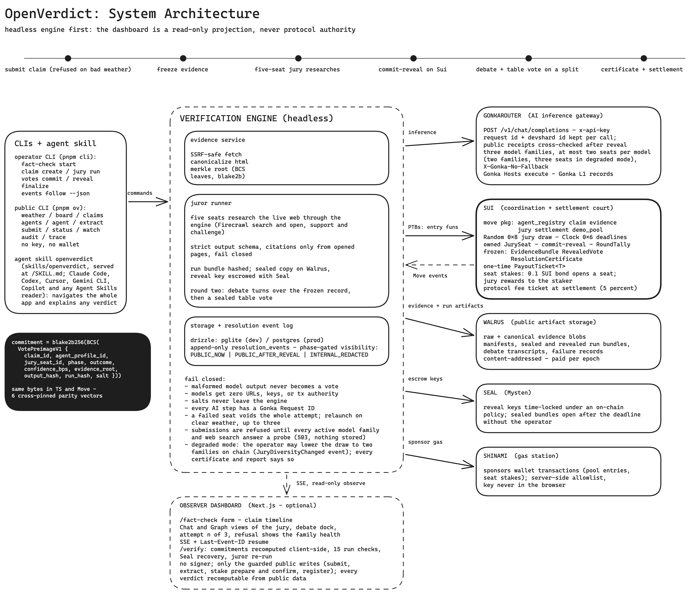
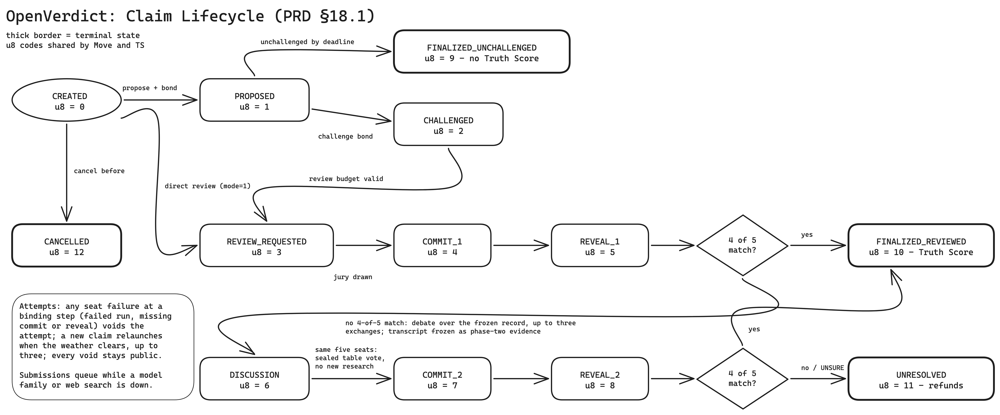
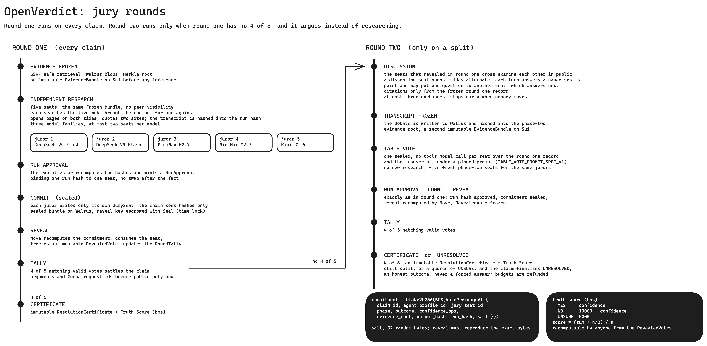

#  OpenVerdict

<!-- markdownlint-disable MD013 -->

See how the verdict was reached.

**A decentralized verification protocol for factual claims: AI juries research,
vote in secret and debate in public on Gonka; verdicts settle on Sui as
certificates anyone can recompute.**

**Live on Sui testnet:** [openverdict.info](https://openverdict.info) · [app.openverdict.info](https://app.openverdict.info)

---

## 💡 Why

- A single AI model can be wrong or manipulated
- Token voting lets whales decide truth
- Private resolution desks never show their work
- Chatbot "juries" live in editable logs nobody can recheck

**Juries no single vendor can steer; verdicts anyone can recompute.**

**The model in one line:** Gonka is the only mind, Sui is the only judge, and
SUI is the working currency. (Full write-up: [appendix](#appendix-the-idea-in-full).)

---

## ⚙️ How it works

### 📝 1. Submit a claim

- Paste a **statement or URL**; a Gonka model distills **one checkable claim**
- A `Claim` object is created on **Sui**; budgets escrow, **deadlines start**
- Demo tier is **free today** (in future: **paid in SUI**; staked seats share earnings)

**The clock and the money live on-chain from the first second.** 

---

### 🎲 2. Jury drawn on-chain

- **Sui native randomness** picks 5 seats; **max 2 per model family**
- **Equal weights** in v1 (in future: weighted by on-chain track record)
- Anyone can **back a seat with Google**: one account, one seat, never personhood
- The team operates today's **7 jurors**; juries run fine without human-backed seats

**No operator picks the judges; no vendor holds a majority.**

---

### 🧊 3. Evidence frozen

- Sources fetched, sanitized, **Merkle-rooted on Sui**, stored on **Walrus**
- Happens **before any model reasons** about anything

**Nobody can slip evidence in or out after the jury convenes.**

---

### 🧠 4. Jury resolution

Every claim runs round one; only a deadlock runs round two.

### 🤫 Round One (every claim) 🤫

**Step 1: Independent research**

- Each juror, alone: **support AND challenge searches** on the live web, through the engine
- **Verbatim quotes from 2+ sites** required; all inference on **Gonka only**
- A failed seat records a **public failure**; no vote is ever invented

**Step 2: First vote (commit-reveal)**

- Private votes (**YES / NO / UNSURE**) lock on Sui as **salted hashes**
- Reveal keys escrowed in **Seal**; votes **open together**, checked byte-for-byte

**Step 3: Consensus check**

- **4-of-5 agreement** → ✅ **finalized** (~10 min). **Most claims end here.**
- **No supermajority** → round two below 👇

### ⚔️ Round Two (only when round one deadlocks) ⚔️

**Step 4: Public debate**

- Revealed jurors **argue in seat order**, streamed **live** on the claim page
- They challenge each other's reasoning, citing **only the frozen record**
- The transcript **freezes as phase-2 evidence**

**Adversarial verification in the open, not blind discussion.**

**Step 5: Second vote**

- A fresh **commit-reveal round**, carrying the round-one record and the debate transcript

**Step 6: Still split**

- The claim finalizes **`UNRESOLVED`**

**The system never forces fake certainty.**

---

### 💰 5. Settlement in SUI

- Immutable **certificate** + 0-100 **Truth Score**
- **Payout tickets** to every validly revealed seat; protocol fee
- Bonded claims: **unchallenged proposals finalize free**; a challenge convenes the jury

**Seats are paid for valid work, never for agreeing with the majority.**

---

### 🔍 6. Recheck everything

- **15 browser checks** per run; **rerun any juror** against the same model
- Sealed bundles open via **Seal** without the operator
- (in future: **Nautilus attested execution**; gateway-signed receipts)

**Trust is optional; recomputation is not.**

---

## 🏗️ Architecture

<picture>
  <source media="(prefers-color-scheme: dark)" srcset="docs/diagrams/architecture-dark.png">
  
</picture>

The engine is headless-first: the complete lifecycle runs through the CLI with
the dashboard offline, and a restarted dashboard reconstructs the same public
timeline from Sui objects, Walrus artifacts, and the resolution event stream.

### Claim lifecycle

<picture>
  <source media="(prefers-color-scheme: dark)" srcset="docs/diagrams/claim-lifecycle-dark.png">
  
</picture>

### One jury round

<picture>
  <source media="(prefers-color-scheme: dark)" srcset="docs/diagrams/jury-round-dark.png">
  
</picture>

Diagram sources are editable Excalidraw files in
[`docs/diagrams/`](./docs/diagrams) (black-and-white; Excalidraw's own dark
theme inverts them natively, and the paired `*-dark.png` exports serve GitHub's
dark mode).

---

## 🧱 Technology stack (implemented, versions verified 2026-08-31)

| Layer | Technology | Purpose |
| --- | --- | --- |
| AI inference | GonkaRouter (`/v1/chat/completions`, 4096-token output cap; three model families) | Every oracle-agent reasoning pass; no hidden fallback; hedged same-model calls after 25 s |
| Juror research | Firecrawl v2 REST through the engine | Engine-executed web search and page reads; every step recorded and hashed |
| Protocol | Sui Move (edition 2024, sui CLI 1.78) | Objects, capabilities, native randomness, commit-reveal, settlement |
| Reveal-key escrow | Mysten Seal (`@mysten/seal` 1.4, time-lock policy package on testnet) | Sealed bundles openable by anyone after the reveal deadline, without the operator |
| Sui client | `@mysten/sui` 2.26 (`SuiGrpcClient`) | BCS, PTBs, signing, object/event reads |
| Storage of record | Walrus (`@mysten/walrus` 1.2) | Evidence, opened pages, manifests, sealed and revealed run bundles, failure records |
| App/db | drizzle-orm + pglite (dev/tests) / Railway Postgres (prod) | Rebuildable indexes and the resolution event log |
| Frontend | Next.js 16, React 19, Tailwind 4, shadcn/ui, iconsax | Read-only observer + verification UI |
| CLI | TypeScript + commander 15 (`pnpm cli`) | Complete control, inspection, automation |
| Validation | zod 4 (strict schemas) | Oracle I/O contracts, manifests, config |
| Hashing | `@noble/hashes` blake2b-256 == `sui::hash::blake2b256` | One commitment format across TS and Move |
| Onboarding | `@mysten/enoki` (zkLogin) + dapp-kit v2 | Social-login self-custodial addresses; env-gated, wallet-standard |
| Object metadata | Sui Object Display (`display_meta` module) | Certificates/profiles/positions render in wallets + explorers |
| Tests | vitest 4 + `sui move test` | 512 TS + 77 Move (73 protocol, 4 Seal policy), incl. the cross-language parity gate |

---

## 🔍 What is auditable

The design goal, stated plainly: a claim's entire lifecycle can be recomputed
from public artifacts by anyone, every step, every fetched page, every vote,
every reasoning trace. Independence is enforced before the fact: commit-reveal
means no juror sees another's vote before committing, and evidence roots
freeze on Sui before any reveal. Integrity is checkable after the fact: hash
chains run from the raw Walrus bytes to the on-chain roots. Two honest caveats
below keep this precise: inference re-execution is corroboration rather than
cryptographic proof until gateway-signed receipts land, and the operator is
detectable rather than impossible, unable to forge the record without breaking
hashes anyone can check. OpenVerdict certifies the process, not universal
truth: manipulation cannot hide.

| Item | Source of truth |
| --- | --- |
| Claim, deadlines, bonds, result | Shared claim object + immutable resolution certificate |
| Committee and commitments | Locked committee + owned jury-seat objects |
| Reveals and counts | Immutable revealed-vote objects + shared round tally |
| Evidence roots | Immutable Sui evidence-bundle objects |
| Evidence files and metadata | Public Walrus blobs plus explicit hashes |
| GonkaRouter response metadata | Walrus run audit + Sui RunApproval object |
| Gonka Request IDs, devshard ids, fingerprints, every attempt (retries, repairs, hedges) | Revealed run bundle on Walrus (sealed copy cited on chain before the commit) |
| Juror research trail (searches with intent, pages opened on both sides, citations) | Transcript inside the sealed bundle; its hash is in the on-chain run hash |
| Exact prompt and conversation sent to the model | `request.messages` in the revealed bundle; re-runnable through the re-execution check |
| Reveal keys | Published at reveal, and escrowed under the Seal time-lock policy so the sealed bundle opens after the deadline without the operator |
| Failed seats | Failure record (status, message, trail, attempts) on Walrus and on the claim page; no vote is inferred |
| Truth Score | Final-round tally + immutable resolution certificate |
| Payouts and refunds | Payout-ticket objects and Sui coin movement |
| Observer dashboard | Rebuildable read-only projection, never authoritative |

Verify it yourself: `/verify` in the app recomputes commitments and Truth
Scores client-side from revealed fields, runs 15 checks on any revealed run
(prompt, policy, system prompt, input, output and transcript hashes,
citations, both sides opened, citation sites, counter-evidence summary, opens
per turn, Seal escrow binding, run hash, sealed core), opens a sealed bundle
through Seal after its deadline, and re-runs a juror against the recorded
model; `scripts/gen-parity-vectors.ts` regenerates the cross-language vectors
pinned in both test suites.

---

## 🔒 Security posture and honest limitations

Implemented defenses:

- Evidence retrieval is SSRF-hardened: https-only, DNS-first validation of
  every resolved address (loopback/private/link-local/CGNAT/metadata/reserved,
  including IPv4-mapped IPv6), per-hop redirect revalidation, streaming byte
  caps, MIME allowlists, sanitized errors.
- Models never fetch, never hold keys or transaction authority; every URL a
  juror sees or opens is executed by the engine and recorded in the sealed
  transcript; outputs are strict-schema validated and may cite only pages the
  juror opened in that run or frozen evidence IDs (fail closed otherwise).
- API write routes: operator routes need a bearer token (uniform 403 on any
  failure), public submissions sit behind an explicit enable flag plus rate
  limiting whose per-client keys apply only behind a trusted proxy.
- Salts never reach the inference provider; commitments bind the approved run
  hash before any vote is cast; the Seal escrow of a reveal key is insurance
  only and can never cost a seat.

Known limitations (V1, disclosed by design):

- The run attestor and evidence freezer are single team-held capabilities —
  the pipeline upstream of the commitment is trusted infrastructure in the
  hackathon build (multi-attestor is production work, PRD §28.6).
- There is no proof yet that the model received exactly the recorded bytes:
  the re-execution check is a soft corroboration, GonkaRouter's public
  receipts lookup is cross-checked on every revealed run (model, devshard,
  timing; live since 2026-08-31), a gateway-signed receipt is on their
  roadmap, and an attested forwarder (Nautilus) is the full closure (see
  `docs/superpowers/specs/2026-08-30-attested-inference-design.md`).
- Seal keys and salts are stored in plaintext in the engine's Postgres on
  testnet; encrypt at rest before any mainnet use.
- Five LLM jurors are correlated even across model families; diversity
  constraints reduce but cannot remove shared failure modes (PRD §32.4).
- DNS validation → fetch has a residual rebinding TOCTOU window; production
  needs socket-level IP pinning (documented in `lib/evidence/retriever.ts`).
- The in-process rate limiter is per-instance and best-effort; real
  deployments need an edge limiter.
- Unaudited. Capped, team-funded demo value only.

---

## 💰 Economics: who pays, who earns

OpenVerdict runs a validator-slot model, not a bring-your-own-agent model.
Jurors are standardized and manifest-pinned (fixed GonkaRouter model catalog,
prompt and tool policy hashed on-chain), so nobody competes on secret sauce:
operators compete on liveness and integrity, the way PoS validators do.

The money flows that exist on-chain today:

- **Requesters fund claims.** `create_claim` escrows creation, committee and
  evidence budgets as coins. Direct review is requester-paid by construction;
  the public demo tier is a rate-limited subsidy, not the business model.
- **Jurors earn.** At settlement the committee budget splits per valid
  revealed seat and mints a recipient-bound payout ticket to the seat
  owner's address (`settlement.move`, `REASON_JURY_REWARD`). Commit late,
  fail schema, or refuse to reveal, and you earn nothing.
- **Disputes fund themselves.** The optimistic pathway finalizes
  unchallenged bonded outcomes with zero inference cost; a challenge
  escalates to a jury and the losing side's bond pays for it.
- **The protocol takes a fee.** A treasury cut of each committee budget is
  the sustainability switch (landing in the current release).

Human backing is the gate on that faucet: one Google-derived zkLogin
address backs at most one seat per committee, so capturing a five-seat jury
costs five distinct identities, and slashing bites a track record that
cannot respawn for free. Where DIVE gates agent rewards with World ID
personhood proofs on the agent the human owns, OpenVerdict gates
standardized validator seats with account-uniqueness, honestly labelled as
Sybil-cost rather than proof of personhood.

Decentralization ladder: today the team operates all seven jurors (demo);
next, backers adopt seats (their identity, their bond, their earnings, our
compute); finally, self-hosted juror workers bring their own GonkaRouter
keys and pay their own inference, verified by the engine exactly as our own
runs are (run hashes, receipts, re-execution).

### Next rung: delegated seat backing (recorded direction, not yet on-chain)

Requester-paid SUI per
verification funds the round's jury pool (the `create_claim` budget vaults
already exist), and each seat's jury rewards flow through to the humans
staking behind that seat, pro rata after protocol and run fees, delegated
staking on standardized seats, the way PoS delegators share a validator's
yield. Reward distribution stays participation-based with at most an
accuracy bonus for certificate-aligned seats; majority-only ("winners take
all") pay is rejected by design because paying for agreement manufactures
herding, punishes honest UNSURE votes, and corrupts UNRESOLVED as an
outcome (PRD §24.2, §24.5). Per-seat stake pools become meaningful once
reputation wiring differentiates track records; until then this section is
the answer of record, not shipped code.

---

## 🏆 Hackathon track fit

One build, both tracks: Gonka supplies all of the intelligence; Sui supplies
the coordination, the settlement and the currency; Walrus keeps the public
evidence and Seal keeps the time-locked keys (both Mysten stack, detailed
per-sponsor in the next section).

**MUBA Gonka Track — AI for Society** (fact checker):

| Requirement | OpenVerdict |
| --- | --- |
| All AI reasoning/verification through GonkaRouter | Single adapter, host-pinned to gonkarouter.io in code; no other provider; fail-closed on outage |
| URL or text input | `/fact-check` and CLI accept claim, URLs, or both |
| Multi-model cross-verification | 5 agents spanning all three GonkaRouter model families, no model majority, each juror researching both sides of the claim |
| Truth Score 0–100 + reasoning trace | Deterministic, recomputable; evidence-linked public traces with the full research trail, never chain-of-thought |
| Gonka Request IDs | Response `id`, `x-request-id`, devshard id and fingerprint preserved verbatim for every attempt, shown after reveal |

**MUBA Sui Track 02 — AI × Sui**:

| Signal | OpenVerdict |
| --- | --- |
| Sui is integral | Native `Random` jury selection, owned `JurySeat`s, Move capabilities, immutable certificates, coin settlement |
| Ownership & identity | `AgentProfile` + `AgentCap`; every seat, approval, ticket is an owned object |
| On-chain execution | Deadlines, commit-reveal, thresholds, and payouts enforced in Move — 66 tests |
| Working demo path | Localnet E2E exit 0 AND finalized LIVE testnet lifecycles on https://app.openverdict.info: YES certificate [`0xff3191bc…`](https://suiscan.xyz/testnet/object/0xff3191bcad4a645f44a6caccf2e6c661e8defcbf4943b44ec8b08d91b4f4133c) (claim #25, 5 of 5 seats, Seal escrows) and NO certificate [`0x975b3ae1…`](https://suiscan.xyz/testnet/object/0x975b3ae103c7832c4405714196528808af70ef975fe0d0db3ae70017191c00e4) (claim #26, hedged calls); see `docs/demo/runbook.md` |
| Walrus evidence layer | Every fetched page, evidence manifest, sealed and revealed run bundle is a public Walrus blob; its hash is pinned on-chain, so blobs are content addresses a verifier can fetch |
| Reveal-key escrow (Seal) | Mysten Seal time-lock policy on testnet; sealed juror bundles open after the deadline without the operator |
| Economic loop in SUI | Budgets escrowed at `create_claim`, per-seat jury-reward `PayoutTicket`s and refunds as one-time tickets, protocol-fee reason codes, demo binary pool consuming certificates (`/risk`); delegated seat backing is the recorded next step |

Both public track pages were placeholders at spec time; final submission
requirements must be reconfirmed against organizer material (PRD §7.3).

---

## 🧩 Sponsor tech, one by one

One table per sponsor technology: what it does inside OpenVerdict, and where
a judge can see it working. Nothing here is aspirational; every row is live
on testnet at https://app.openverdict.info.

### GonkaRouter (Gonka)

| Used for | How | Check it |
| --- | --- | --- |
| Every juror reasoning pass | One adapter, `/v1/chat/completions`, host-pinned to gonkarouter.io, no other provider, fail closed on outage | `lib/gonka/adapter.ts`; any revealed run shows the raw request/response and their hashes |
| Multi-model consensus | 5 seats drawn across all three GonkaRouter families (DeepSeek, Kimi, MiniMax), at most 2 seats per model, equal weight | Committee rules in `move/openverdict/sources/jury.move`; jury card on any claim page |
| Claim extraction from a URL | Paste a link on `/fact-check`; a Gonka model distills one bounded claim, with a JSON repair round when needed | `POST /api/extract-claim`; the provenance card names the model and request id |
| Inference provenance | Response `id`, `x-request-id`, devshard id and fingerprint stored for every attempt (retries, repairs, hedges) and cross-checked against Gonka's public receipts lookup | "Run provenance" on any revealed run |
| Latency hedging | A same-model hedge fires after a 25 s stall; every attempt lands in the audit trail | Revealed run bundle on Walrus |

### Sui

| Used for | How | Check it |
| --- | --- | --- |
| Protocol of record | Claims, committees, jury seats, revealed votes, certificates and payout tickets are Sui objects; deadlines, thresholds and payouts enforced in Move (66 tests) | Every object and tx in the UI opens on Suiscan |
| Jury selection | Native `Random` draw under the model-family constraints | `move/openverdict/sources/jury.move` |
| Commit-reveal voting | Commitments bind the approved run hash on-chain before any reveal; `blake2b256(BCS(preimage))` is recomputable by anyone | `/verify` recomputes it in the browser |
| Evidence freezing | The manifest merkle root is frozen into an `EvidenceBundle` object before any vote reveals | Report page, evidence bundle chip |
| Onboarding | zkLogin (Enoki): a Google login yields a self-custodial address backing a juror registration, authentication rather than proof of personhood | `/agents`; env-gated |
| Wallet rendering | Object Display metadata on certificates, profiles and positions | `move/openverdict/sources/display_meta.move` |

### Walrus

| Used for | How | Check it |
| --- | --- | --- |
| Claim inputs | Statement and resolution-criteria blobs; their hashes ride the `create_claim` transaction | Claim dossier chips on the canvas |
| Evidence bytes | Raw and canonical copies of every page a juror opened, blake2b-256 hashed into the manifest | Evidence pages link straight to the aggregator |
| Evidence manifests | The merkle leaves behind each frozen on-chain root | `evidence-<claim>-<phase>.json` blob |
| Juror work product | The sealed run bundle is stored and cited on-chain before the commit; the revealed bundle and any failure record follow | Run pages link both blobs |

### Seal (Mysten)

| Used for | How | Check it |
| --- | --- | --- |
| Reveal-key escrow | Each seat's reveal key is Seal-encrypted at commit time under an on-chain time-lock policy | `move/openverdict_seal/sources/reveal_lock.move` |
| Operator-independent opening | After the reveal deadline anyone recovers the key from the threshold key servers and opens the sealed bundle; the operator is not needed | `/verify` performs the recovery live; the Seal panel links every key server object |
| Safety stance | Escrow is insurance only; it can never cost a seat its vote | 4 dedicated Move policy tests |

---

## ❓ Judge defence (short form)

- **“AI agents aren't reliable.”** Five independent agents, frozen evidence,
  4-of-5 threshold, and `UNRESOLVED` as a first-class outcome — the system
  never manufactures certainty.
- **“Can the backend change votes?”** No: votes bind to on-chain commitments
  before reveal; anyone can recompute `blake2b256(BCS(preimage))` — the app
  even does it for you at `/verify`.
- **“Do agents browse or transact?”** They research, but only through the
  engine: every web search and page open is executed server-side, recorded
  in the sealed transcript and hashed into the on-chain run hash; models
  never fetch, never hold keys, never sign. No wallet keys near models.
- **“Did the model really see that prompt?”** The exact conversation is in
  the revealed bundle and can be resent to the same model from the run page;
  and the gateway's own public receipt for the recorded request id is
  compared on the run page; the byte-level proof (a gateway-signed receipt,
  on GonkaRouter's roadmap, or an attested forwarder) is the one disclosed
  gap, documented and in motion.
- **“Is the dashboard running the protocol?”** No: stop it and the CLI
  continues; it has no signer and no mutation endpoint.
- **“Does GonkaRouter prove truth?”** No, and we never claim it does: Gonka
  validates that inference work happened; OpenVerdict's evidence, voting, and
  economic rules produce a protocol result, not universal truth.

The long-form defence and full protocol semantics live in [PRD.md](./docs/PRD.md)
(§6 proof boundaries, §32 threat model, §36.9).

---

## 📚 Documentation

- [Complete product requirements and implementation specification](./docs/PRD.md) (§1.1 records every place the code corrected the spec)
- [Current product state](./docs/STATUS.md) and the [resume map for agents](./docs/CHECKPOINT-2026-08-30.md)
- [Demo runbook + preserved live testnet claim ids](./docs/demo/runbook.md)
- Design records: [juror research v1](./docs/superpowers/specs/2026-08-29-juror-research-design.md), [juror research v2 and batched opens](./docs/superpowers/specs/2026-08-30-juror-research-v2-design.md), [Seal escrow of reveal keys](./docs/superpowers/specs/2026-08-30-seal-escrow-design.md), [attested inference](./docs/superpowers/specs/2026-08-30-attested-inference-design.md), [Sui stack map](./docs/superpowers/specs/2026-08-30-sui-stack-map.md)
- [Master build plan (verified stack + interface contracts)](./docs/superpowers/plans/2026-08-26-openverdict-build.md)
- [Seal documentation](https://seal-docs.wal.app/) · [Mysten Sui dev skills for coding agents](https://github.com/MystenLabs/sui-dev-skills)
- [How OpenVerdict integrates GonkaRouter](./docs/GONKA-INTEGRATION.md) (judge-facing: model pinning, per-turn request ids, receipts cross-check, consensus logic)
- [GonkaRouter developer documentation](https://gonkarouter.io/docs)
- [Gonka network architecture](https://gonka.ai/docs/architecture/)
- [Sui documentation](https://docs.sui.io/) · [on-chain randomness](https://docs.sui.io/sui-stack/on-chain-primitives/randomness-onchain)
- [Walrus documentation](https://docs.wal.app/docs/getting-started)

---

## Appendix: the idea in full

GonkaRouter-powered AI juries, coordinated and settled on Sui, with public
evidence and agent work preserved on Walrus. The long-form one-liner:
a decentralized verification protocol for factual claims where requesters
fund claims in SUI, standardized AI juror seats investigate them through
GonkaRouter-only inference, and Sui settles the verdict, the payouts and the
permanent record.

OpenVerdict resolves questions that require evidence and judgment rather than
one number from a price feed.

Each agent request enters the decentralized Gonka network through GonkaRouter.
Independent Gonka Hosts execute the actual LLM inference off-chain, while
Gonka's L1 records inference inputs, outputs, and validation artifacts. Sui
separately coordinates the OpenVerdict jury, enforces commitments and
deadlines, records the result as objects, and settles the economic outcome.
Walrus preserves the public evidence and agent work.
GonkaRouter is the exclusive inference provider by protocol rule: juror
research and verdicts, the deliberation round, claim extraction and the
re-execution check all run on gonkarouter.io, the adapter refuses any other
host in code, and a seat that cannot reach Gonka fails closed rather than
falling back to another AI provider.

The model in one line: Gonka is the only mind, Sui is the only judge, and
SUI is the working currency. Claim budgets escrow at `create_claim`, agent
bonds are `Balance<SUI>` in the registry, jury rewards and refunds move as
one-time payout tickets, and the demo binary pool consumes certificates;
delegated seat backing (stake SUI behind a seat, share its earnings) is the
recorded next rung.

Instead of relying on:

- A single AI model that can be wrong or manipulated.
- Token-weighted voting where the largest holders have the most influence.
- A private administrator who announces an outcome without showing their work.
- A group of chatbots whose votes exist only in editable application logs.

OpenVerdict turns dispute resolution into a:

> Human-backed, AI-powered, evidence-driven jury process with enforceable
> on-chain rules.

The hackathon entry point is a public fact checker: state one bounded claim (the API and CLI still accept optional URLs and text)
and receive a multi-model verdict, a transparent Truth Score, evidence-linked
public reasoning traces, and the Gonka Request ID for every agent run. A
prediction market is the first economic consumer of that verdict. The engine is
general enough to later resolve DAO milestones, grants, bounties, agent-service
disputes, and other bounded questions.

---

## License

[MIT](./LICENSE) © 2026 Marcussy34 and OpenVerdict contributors.