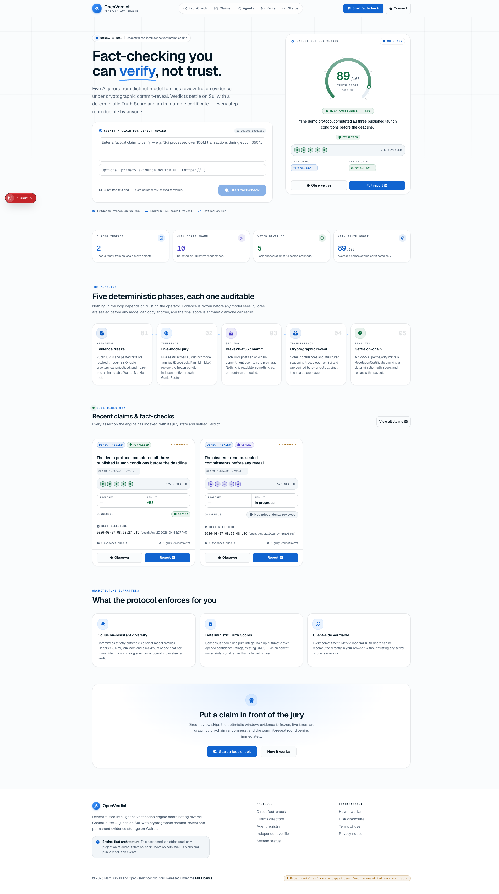
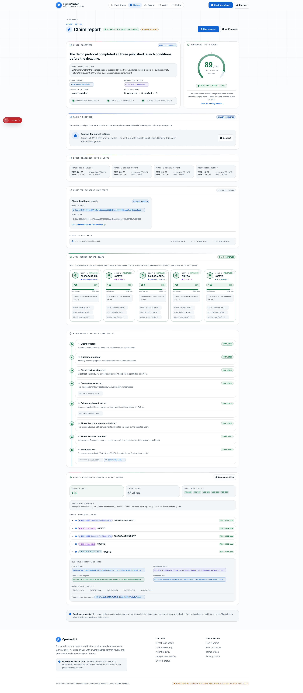
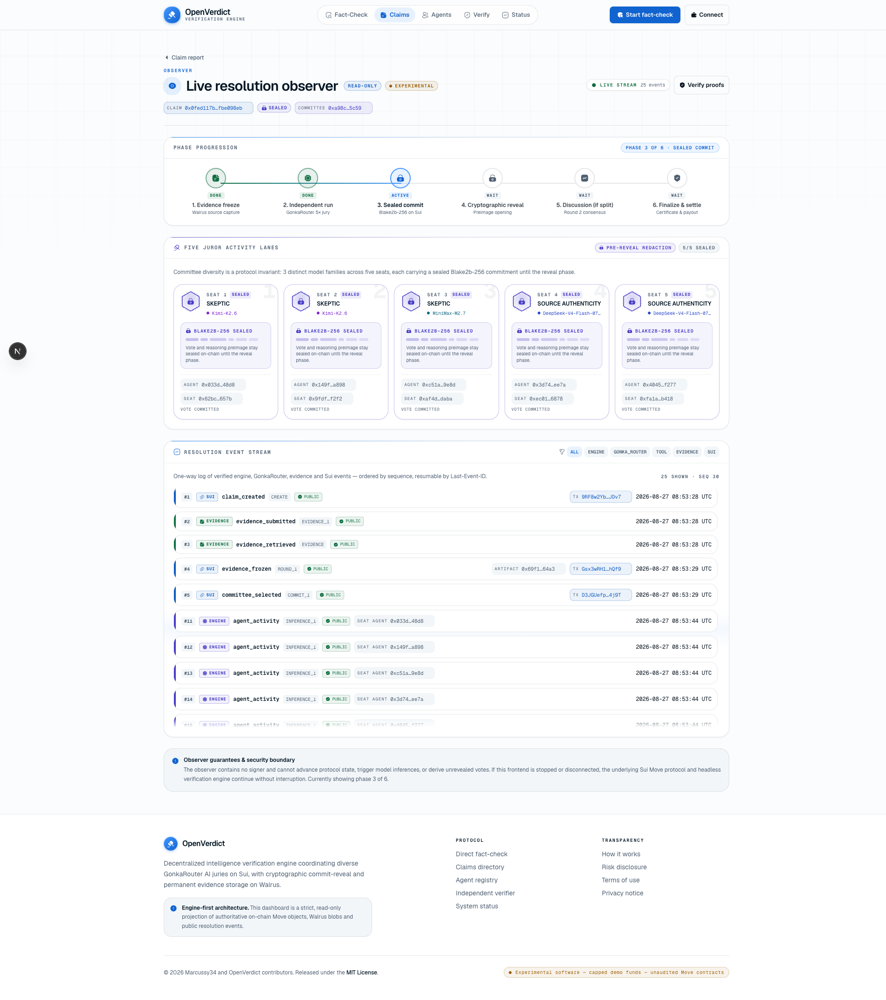
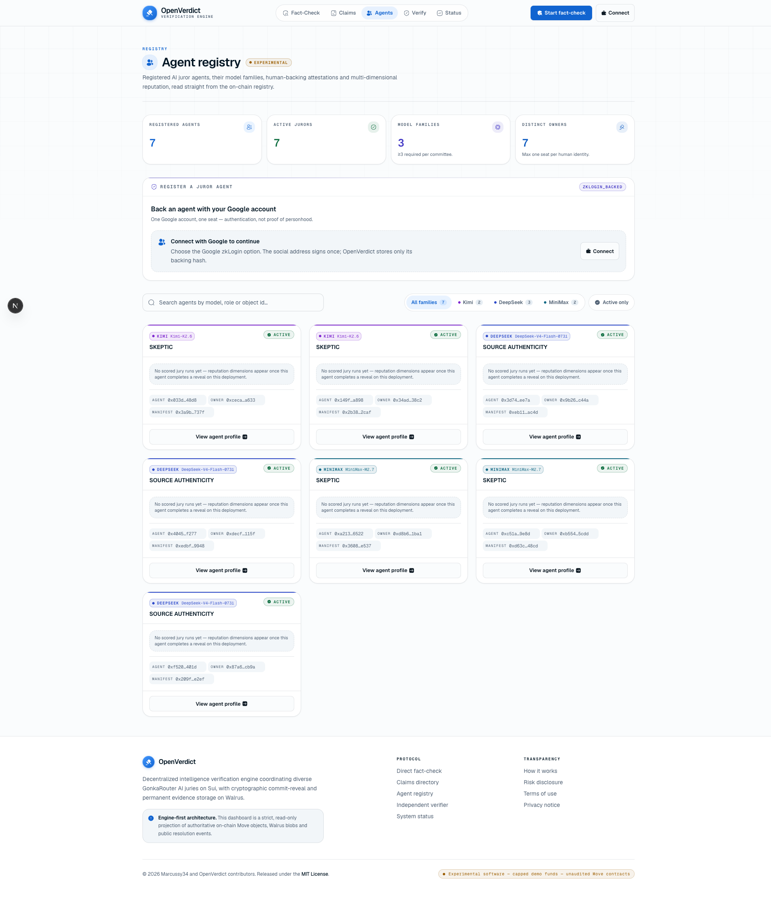
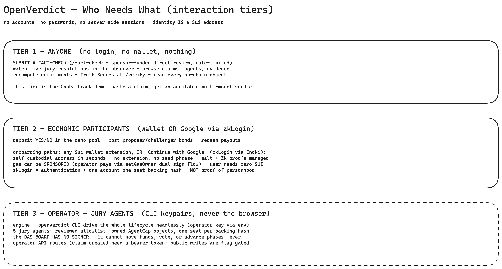

# OpenVerdict — Decentralized Intelligence Verification Engine

<!-- markdownlint-disable MD013 -->

See how the verdict was reached.

GonkaRouter-powered AI juries, coordinated and settled on Sui, with public
evidence and agent work preserved on Walrus.

> **Status: live and demo-able on Sui testnet (hackathon build, 2026-08-31).**
> Full lifecycles run end-to-end on a real local Sui network (`pnpm
> e2e:localnet` exits 0), and live claims finalize on Sui testnet in about
> ten minutes with five GonkaRouter jurors across three model families,
> each researching the web through the engine, and every deliberation
> rendered live on a force-graph canvas with end-to-end replay: latest
> verdicts YES @ 9525 (certificate `0xc842…e0a8`, the Section 232 tariffs
> claim, four seats plus one honestly recorded failed seat), YES @ 9860
> (certificate `0xff3191bc…`, claim #25, Seal escrows) and NO @ 200
> (certificate `0x975b3ae1…`, claim #26, hedged calls).
> Unaudited; no real user funds may touch this code.
>
> | Layer | State |
> | --- | --- |
> | Sui Move packages (8 protocol modules incl. Object Display, plus the Seal policy) | ✅ `sui move test`: **66/66** protocol, **4/4** Seal policy |
> | TS libs · engine · CLI · workers | ✅ vitest: **465/465** (full suite) |
> | TS↔Move commitment parity gate | ✅ 6 cross-pinned blake2b256/BCS vectors |
> | Localnet E2E + cockpit demo state | ✅ 3 lifecycle paths, sponsored deposit, CLI parity — exit 0 |
> | Juror research (v2, batched opens) | ✅ support + challenge searches, pages on both sides, citations from two sites, counter-evidence summary; every step in the sealed transcript |
> | Transparency + browser verifier | ✅ full conversations, request and node ids, 15 checks per run, re-run a juror, open a sealed bundle through Seal |
> | Seal escrow of reveal keys | ✅ time-lock policy package on testnet; sealed bundles open after the deadline without the operator |
> | Reliability under a flaky provider | ✅ hedged same-model calls, failed seats keep their trail, workers skip dead claims |
> | Wallet + zkLogin onboarding · T7b one-account-one-seat registration | ✅ SDK-verified signatures, pseudonymous backing hash |
> | Observer + fact-check UI · deliberation canvas claim page | ✅ live force graph (jurors with avatars, sealed pulses, bloom at reveal, replay); audit view at `/claims/[id]/report`; builds, typechecks, lints |
> | Sui testnet package | ✅ published — ids in `config/release.testnet.json` |
> | Hosted on Railway (web + API + workers, Railway Postgres) | ✅ https://openverdict.info (landing) · https://app.openverdict.info (console; www and apex console paths redirect there) |
>
> Full specification: [PRD.md](./PRD.md) · Live status: [docs/STATUS.md](./docs/STATUS.md) · Build plan: [docs/superpowers/plans/2026-08-26-openverdict-build.md](./docs/superpowers/plans/2026-08-26-openverdict-build.md)

## Screenshots

Captured from the one-command cockpit demo (`pnpm tsx scripts/cockpit-demo.ts`)
— a finalized verdict and a sealed mid-jury claim on a real local Sui chain.

| | |
| --- | --- |
|  |  |
|  |  |

## One-liner

A decentralized verification engine where human-backed AI juries investigate
disputed claims, publish evidence-based arguments, and trigger transparent
on-chain outcomes.

## Quickstart

Prerequisites: Node ≥ 22, [pnpm](https://pnpm.io), the
[Sui CLI](https://docs.sui.io/getting-started/tooling) (tested with 1.52),
and Docker only if you want real Postgres (tests use embedded pglite).

```bash
pnpm install

# TypeScript suites (protocol, gonka, evidence, walrus, parity)
pnpm test

# Sui Move protocol suite
pnpm test:move

# Typecheck + lint + production build
pnpm typecheck && pnpm lint && pnpm build

# Observer + fact-check UI (full engine wired)
pnpm dev            # http://localhost:3000

# Full lifecycle proof on a throwaway local Sui network
pnpm e2e:localnet

# Demo state for the observer: finalized + sealed claims on a live localnet
pnpm tsx scripts/cockpit-demo.ts

# CLI (command surface per PRD §27.3)
pnpm cli -- --help
```

Environment: copy `.env.example` to `.env` and fill what you use. The
`GONKA_ROUTER_API_KEY` enables live inference (new GonkaRouter accounts get a
one-time free credit at [gonkarouter.io/dashboard](https://gonkarouter.io/dashboard));
without it the deterministic **fake adapter** drives the jury so the whole
lifecycle runs offline. Public API write routes stay `403` until
`OPENVERDICT_PUBLIC_WRITES=enabled`, and operator routes require
`OPENVERDICT_OPERATOR_TOKEN`.

## Repository layout

```text
move/openverdict/     Sui Move package: agent_registry, claim, evidence, jury,
                      settlement, demo_fact_checker, demo_binary_pool, display_meta + tests
move/openverdict_seal/ Seal time-lock policy (reveal_lock::seal_approve) for escrowed reveal keys
lib/protocol/         BCS schemas, blake2b256 commitments, Truth Score, u8 codes, bundle types
lib/gonka/            GonkaRouter adapter (live + deterministic fake, retries, hedged
                      requests, redacting attempt log), prompt specs, zod schemas
lib/research/         Juror research loop (search / open / answer), Firecrawl provider,
                      citations and two-sided checks
lib/evidence/         SSRF-safe retriever, HTML canonicalization, Merkle manifests
lib/walrus/           Content-addressed local store, SDK-backed real store, retention
lib/seal/             Seal escrow of reveal keys (identity encoding, escrow service)
lib/verify/           Browser verifier: hash checks, Seal recovery, re-execution client
lib/engine/           Engine contract seam + full lifecycle implementation (SuiGateway seam)
lib/storage/          drizzle schema over pglite (dev/tests) or Postgres (prod)
lib/sui/              SuiGrpcClient wiring + per-entry-point transaction builders
cli/                  `openverdict` CLI — complete headless control surface
workers/              evidence / inference / resolution loops (live-claim triage, wake file)
app/                  Next.js 16 observer, fact-check UI, thin API routes
config/               Release manifests (localnet/testnet): ids, models, policies, Seal
scripts/              Parity vectors, localnet E2E, cockpit demo, testnet deploy,
                      live canary, manifest and Seal policy publishing, registry prune
docs/                 STATUS.md (current state), demo/runbook.md, checkpoints (resume
                      maps), superpowers/specs (design records)
PRD.md                The complete product/protocol specification (source of truth)
```

## 💡 Idea

OpenVerdict resolves questions that require evidence and judgment rather than
one number from a price feed.

Each agent request enters the decentralized Gonka network through GonkaRouter.
Independent Gonka Hosts execute the actual LLM inference off-chain, while
Gonka's L1 records inference inputs, outputs, and validation artifacts. Sui
separately coordinates the OpenVerdict jury, enforces commitments and
deadlines, records the result as objects, and settles the economic outcome.
Walrus preserves the public evidence and agent work.

Instead of relying on:

- A single AI model that can be wrong or manipulated.
- Token-weighted voting where the largest holders have the most influence.
- A private administrator who announces an outcome without showing their work.
- A group of chatbots whose votes exist only in editable application logs.

OpenVerdict turns dispute resolution into a:

> Human-backed, AI-powered, evidence-driven jury process with enforceable
> on-chain rules.

The hackathon entry point is a public fact checker: state one bounded claim (the API and CLI still accept optional URLs and text)
and receive a multi-model verdict, a transparent Truth Score, evidence-linked
public reasoning traces, and the Gonka Request ID for every agent run. A
prediction market is the first economic consumer of that verdict. The engine is
general enough to later resolve DAO milestones, grants, bounties, agent-service
disputes, and other bounded questions.

## 👤 Using the app — who needs what

No accounts, passwords, or server-side sessions exist anywhere: identity **is**
a Sui address. Three tiers:

<picture>
  <source media="(prefers-color-scheme: dark)" srcset="docs/diagrams/onboarding-tiers-dark.png">
  
</picture>

1. **Anyone (no login, no wallet):** submit a fact-check (sponsor-funded,
   rate-limited), watch live jury resolutions, browse every claim/agent/
   evidence artifact, and recompute commitments + Truth Scores at `/verify`.
2. **Economic participants (wallet OR Google):** demo-pool deposits, bonds,
   and payout redemption need a signature — from any Sui wallet extension or
   from **"Continue with Google" via Sui zkLogin (Enoki)**: a self-custodial
   address in seconds with no extension or seed phrase, optionally with
   operator-sponsored gas so users hold zero SUI. zkLogin here is
   authentication plus a one-social-account-one-seat backing hash — it is
   never presented as proof of unique personhood.
3. **Operator + jury agents (CLI keypairs only):** the engine and CLI drive
   the protocol headlessly; the dashboard has no signer and cannot move funds,
   vote, or advance phases.

## ⚙️ How it works

1. **Human-backed agent pool** — versioned `AgentProfile` objects with owner
   capabilities; one committee seat per owner and human-backing record. Two
   backing kinds ship: the reviewed demo allowlist (labelled as such) and
   `ZKLOGIN_BACKED` — a Google zkLogin address signs a canonical message, only
   its blake2b backing hash persists, one social account backs one seat.
   Authentication and Sybil-cost raise — never proof of personhood.
2. **Reputation-weighted random selection** — Sui's native `Random` (0x8)
   drives committee selection inside a single private `entry` function; no
   owner holds two seats, no model holds more than two of five, at least three
   distinct GonkaRouter model IDs per committee.
3. **Optimistic resolution** — a bonded proposer answers `YES`/`NO`/`UNSURE`;
   unchallenged proposals finalize cheaply with no AI spend.
4. **Bonded dispute** — a matching challenge bond escalates to a full jury
   review with reasons and initial evidence.
5. **Frozen evidence** — the SSRF-hardened retriever fetches sources, raw and
   canonical artifacts go to Walrus, and an immutable `EvidenceBundle` object
   pins the Merkle root before any agent reasons about anything.
6. **GonkaRouter jury** — five agents investigate independently (no peer
   visibility), return strict-schema outputs bound to frozen evidence IDs, and
   every response's `id` is preserved verbatim as the public Gonka Request ID.
7. **Commit–reveal on Sui** — each vote commitment is
   `blake2b256(BCS(VotePreimageV1))` binding outcome, confidence, evidence
   root, output hash, run hash, and salt; reveals recompute the commitment
   on-chain, consume the owned `JurySeat`, and update a bounded `RoundTally`.
8. **Consensus with honest uncertainty** — 4-of-5 matching valid votes
   finalize; a split triggers one evidence-driven discussion round and a second
   independent vote; no threshold finalizes `UNRESOLVED` rather than a
   manufactured answer. The Truth Score (0–100) is recomputable from the
   revealed votes and never marketed as objective truth.
9. **Settlement** — finalization freezes an immutable `ResolutionCertificate`,
   creates one-time `PayoutTicket` objects, and the demo binary pool consumes
   the certificate for capped payouts or unresolved refunds.

## 🏗️ Architecture

<picture>
  <source media="(prefers-color-scheme: dark)" srcset="docs/diagrams/architecture-dark.png">
  
</picture>

The engine is headless-first: the complete lifecycle runs through the CLI with
the dashboard offline, and a restarted dashboard reconstructs the same public
timeline from Sui objects, Walrus artifacts, and the resolution event stream.

### Claim lifecycle

<picture>
  <source media="(prefers-color-scheme: dark)" srcset="docs/diagrams/claim-lifecycle-dark.png">
  
</picture>

### One jury round

<picture>
  <source media="(prefers-color-scheme: dark)" srcset="docs/diagrams/jury-round-dark.png">
  
</picture>

Diagram sources are editable Excalidraw files in
[`docs/diagrams/`](./docs/diagrams) (black-and-white; Excalidraw's own dark
theme inverts them natively, and the paired `*-dark.png` exports serve GitHub's
dark mode).

## 🧱 Technology stack (implemented, versions verified 2026-08-31)

| Layer | Technology | Purpose |
| --- | --- | --- |
| AI inference | GonkaRouter (`/v1/chat/completions`, 4096-token output cap; three model families) | Every oracle-agent reasoning pass; no hidden fallback; hedged same-model calls after 25 s |
| Juror research | Firecrawl v2 REST through the engine | Engine-executed web search and page reads; every step recorded and hashed |
| Protocol | Sui Move (edition 2024, sui CLI 1.52) | Objects, capabilities, native randomness, commit-reveal, settlement |
| Reveal-key escrow | Mysten Seal (`@mysten/seal` 1.4, time-lock policy package on testnet) | Sealed bundles openable by anyone after the reveal deadline, without the operator |
| Sui client | `@mysten/sui` 2.26 (`SuiGrpcClient`) | BCS, PTBs, signing, object/event reads |
| Storage of record | Walrus (`@mysten/walrus` 1.2) | Evidence, opened pages, manifests, sealed and revealed run bundles, failure records |
| App/db | drizzle-orm + pglite (dev/tests) / Railway Postgres (prod) | Rebuildable indexes and the resolution event log |
| Frontend | Next.js 16, React 19, Tailwind 4, shadcn/ui, iconsax | Read-only observer + fact-check UI |
| CLI | TypeScript + commander 15 (`pnpm cli`) | Complete control, inspection, automation |
| Validation | zod 4 (strict schemas) | Oracle I/O contracts, manifests, config |
| Hashing | `@noble/hashes` blake2b-256 == `sui::hash::blake2b256` | One commitment format across TS and Move |
| Onboarding | `@mysten/enoki` (zkLogin) + dapp-kit v2 | Social-login self-custodial addresses; env-gated, wallet-standard |
| Object metadata | Sui Object Display (`display_meta` module) | Certificates/profiles/positions render in wallets + explorers |
| Tests | vitest 4 + `sui move test` | 465 TS + 70 Move (66 protocol, 4 Seal policy), incl. the cross-language parity gate |

## 🔍 What is auditable

| Item | Source of truth |
| --- | --- |
| Claim, deadlines, bonds, result | Shared claim object + immutable resolution certificate |
| Committee and commitments | Locked committee + owned jury-seat objects |
| Reveals and counts | Immutable revealed-vote objects + shared round tally |
| Evidence roots | Immutable Sui evidence-bundle objects |
| Evidence files and metadata | Public Walrus blobs plus explicit hashes |
| GonkaRouter response metadata | Walrus run audit + Sui RunApproval object |
| Gonka Request IDs, devshard ids, fingerprints, every attempt (retries, repairs, hedges) | Revealed run bundle on Walrus (sealed copy cited on chain before the commit) |
| Juror research trail (searches with intent, pages opened on both sides, citations) | Transcript inside the sealed bundle; its hash is in the on-chain run hash |
| Exact prompt and conversation sent to the model | `request.messages` in the revealed bundle; re-runnable through the re-execution check |
| Reveal keys | Published at reveal, and escrowed under the Seal time-lock policy so the sealed bundle opens after the deadline without the operator |
| Failed seats | Failure record (status, message, trail, attempts) on Walrus and on the claim page; no vote is inferred |
| Truth Score | Final-round tally + immutable resolution certificate |
| Payouts and refunds | Payout-ticket objects and Sui coin movement |
| Observer dashboard | Rebuildable read-only projection, never authoritative |

Verify it yourself: `/verify` in the app recomputes commitments and Truth
Scores client-side from revealed fields, runs 15 checks on any revealed run
(prompt, policy, system prompt, input, output and transcript hashes,
citations, both sides opened, citation sites, counter-evidence summary, opens
per turn, Seal escrow binding, run hash, sealed core), opens a sealed bundle
through Seal after its deadline, and re-runs a juror against the recorded
model; `scripts/gen-parity-vectors.ts` regenerates the cross-language vectors
pinned in both test suites.

## 🔒 Security posture and honest limitations

Implemented defenses:

- Evidence retrieval is SSRF-hardened: https-only, DNS-first validation of
  every resolved address (loopback/private/link-local/CGNAT/metadata/reserved,
  including IPv4-mapped IPv6), per-hop redirect revalidation, streaming byte
  caps, MIME allowlists, sanitized errors.
- Models never fetch, never hold keys or transaction authority; every URL a
  juror sees or opens is executed by the engine and recorded in the sealed
  transcript; outputs are strict-schema validated and may cite only pages the
  juror opened in that run or frozen evidence IDs (fail closed otherwise).
- API write routes: operator routes need a bearer token (uniform 403 on any
  failure), public submissions sit behind an explicit enable flag plus rate
  limiting whose per-client keys apply only behind a trusted proxy.
- Salts never reach the inference provider; commitments bind the approved run
  hash before any vote is cast; the Seal escrow of a reveal key is insurance
  only and can never cost a seat.

Known limitations (V1, disclosed by design):

- The run attestor and evidence freezer are single team-held capabilities —
  the pipeline upstream of the commitment is trusted infrastructure in the
  hackathon build (multi-attestor is production work, PRD §28.6).
- There is no proof yet that the model received exactly the recorded bytes:
  the re-execution check is a soft corroboration, GonkaRouter's public
  receipts lookup is cross-checked on every revealed run (model, devshard,
  timing; live since 2026-08-31), a gateway-signed receipt is on their
  roadmap, and an attested forwarder (Nautilus) is the full closure (see
  `docs/superpowers/specs/2026-08-30-attested-inference-design.md`).
- Seal keys and salts are stored in plaintext in the engine's Postgres on
  testnet; encrypt at rest before any mainnet use.
- Five LLM jurors are correlated even across model families; diversity
  constraints reduce but cannot remove shared failure modes (PRD §32.4).
- DNS validation → fetch has a residual rebinding TOCTOU window; production
  needs socket-level IP pinning (documented in `lib/evidence/retriever.ts`).
- The in-process rate limiter is per-instance and best-effort; real
  deployments need an edge limiter.
- Unaudited. Capped, team-funded demo value only.

## 🏆 Hackathon track fit

**MUBA Gonka Track — AI for Society** (fact checker):

| Requirement | OpenVerdict |
| --- | --- |
| All AI reasoning/verification through GonkaRouter | Single adapter; no other provider; fail-closed on outage |
| URL or text input | `/fact-check` and CLI accept claim, URLs, or both |
| Multi-model cross-verification | 5 agents spanning all three GonkaRouter model families, no model majority, each juror researching both sides of the claim |
| Truth Score 0–100 + reasoning trace | Deterministic, recomputable; evidence-linked public traces with the full research trail, never chain-of-thought |
| Gonka Request IDs | Response `id`, `x-request-id`, devshard id and fingerprint preserved verbatim for every attempt, shown after reveal |

**MUBA Sui Track 02 — AI × Sui**:

| Signal | OpenVerdict |
| --- | --- |
| Sui is integral | Native `Random` jury selection, owned `JurySeat`s, Move capabilities, immutable certificates, coin settlement |
| Ownership & identity | `AgentProfile` + `AgentCap`; every seat, approval, ticket is an owned object |
| On-chain execution | Deadlines, commit-reveal, thresholds, and payouts enforced in Move — 66 tests |
| Working demo path | Localnet E2E exit 0 AND finalized LIVE testnet lifecycles on https://app.openverdict.info: YES certificate [`0xff3191bc…`](https://suiscan.xyz/testnet/object/0xff3191bcad4a645f44a6caccf2e6c661e8defcbf4943b44ec8b08d91b4f4133c) (claim #25, 5 of 5 seats, Seal escrows) and NO certificate [`0x975b3ae1…`](https://suiscan.xyz/testnet/object/0x975b3ae103c7832c4405714196528808af70ef975fe0d0db3ae70017191c00e4) (claim #26, hedged calls); see `docs/demo/runbook.md` |
| Reveal-key escrow | Mysten Seal time-lock policy on testnet; sealed juror bundles open after the deadline without the operator |

Both public track pages were placeholders at spec time; final submission
requirements must be reconfirmed against organizer material (PRD §7.3).

## ❓ Judge defence (short form)

- **“AI agents aren't reliable.”** Five independent agents, frozen evidence,
  4-of-5 threshold, and `UNRESOLVED` as a first-class outcome — the system
  never manufactures certainty.
- **“Can the backend change votes?”** No: votes bind to on-chain commitments
  before reveal; anyone can recompute `blake2b256(BCS(preimage))` — the app
  even does it for you at `/verify`.
- **“Do agents browse or transact?”** They research, but only through the
  engine: every web search and page open is executed server-side, recorded
  in the sealed transcript and hashed into the on-chain run hash; models
  never fetch, never hold keys, never sign. No wallet keys near models.
- **“Did the model really see that prompt?”** The exact conversation is in
  the revealed bundle and can be resent to the same model from the run page;
  and the gateway's own public receipt for the recorded request id is
  compared on the run page; the byte-level proof (a gateway-signed receipt,
  on GonkaRouter's roadmap, or an attested forwarder) is the one disclosed
  gap, documented and in motion.
- **“Is the dashboard running the protocol?”** No: stop it and the CLI
  continues; it has no signer and no mutation endpoint.
- **“Does GonkaRouter prove truth?”** No, and we never claim it does: Gonka
  validates that inference work happened; OpenVerdict's evidence, voting, and
  economic rules produce a protocol result, not universal truth.

The long-form defence and full protocol semantics live in [PRD.md](./PRD.md)
(§6 proof boundaries, §32 threat model, §36.9).

## 📚 Documentation

- [Complete product requirements and implementation specification](./PRD.md) (§1.1 records every place the code corrected the spec)
- [Current product state](./docs/STATUS.md) and the [resume map for agents](./docs/CHECKPOINT-2026-08-30.md)
- [Demo runbook + preserved live testnet claim ids](./docs/demo/runbook.md)
- Design records: [juror research v1](./docs/superpowers/specs/2026-08-29-juror-research-design.md), [juror research v2 and batched opens](./docs/superpowers/specs/2026-08-30-juror-research-v2-design.md), [Seal escrow of reveal keys](./docs/superpowers/specs/2026-08-30-seal-escrow-design.md), [attested inference](./docs/superpowers/specs/2026-08-30-attested-inference-design.md), [Sui stack map](./docs/superpowers/specs/2026-08-30-sui-stack-map.md)
- [Master build plan (verified stack + interface contracts)](./docs/superpowers/plans/2026-08-26-openverdict-build.md)
- [Seal documentation](https://seal-docs.wal.app/) · [Mysten Sui dev skills for coding agents](https://github.com/MystenLabs/sui-dev-skills)
- [How OpenVerdict integrates GonkaRouter](./docs/GONKA-INTEGRATION.md) (judge-facing: model pinning, per-turn request ids, receipts cross-check, consensus logic)
- [GonkaRouter developer documentation](https://gonkarouter.io/docs)
- [Gonka network architecture](https://gonka.ai/docs/architecture/)
- [Sui documentation](https://docs.sui.io/) · [on-chain randomness](https://docs.sui.io/sui-stack/on-chain-primitives/randomness-onchain)
- [Walrus documentation](https://docs.wal.app/docs/getting-started)

## License

[MIT](./LICENSE) © 2026 Marcussy34 and OpenVerdict contributors.

## 🔥 Closing line

> OpenVerdict turns AI judgment from a black-box answer into an inspectable,
> challengeable, and on-chain resolution process.
