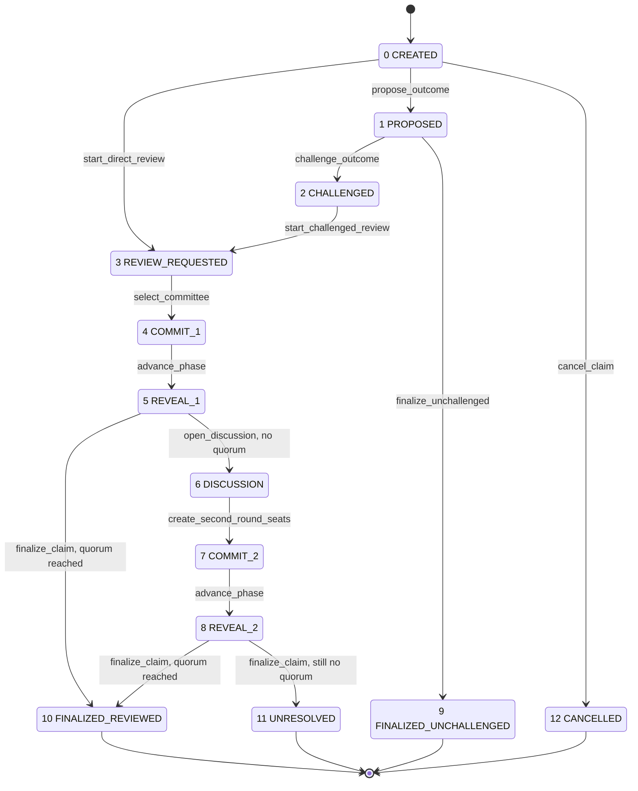
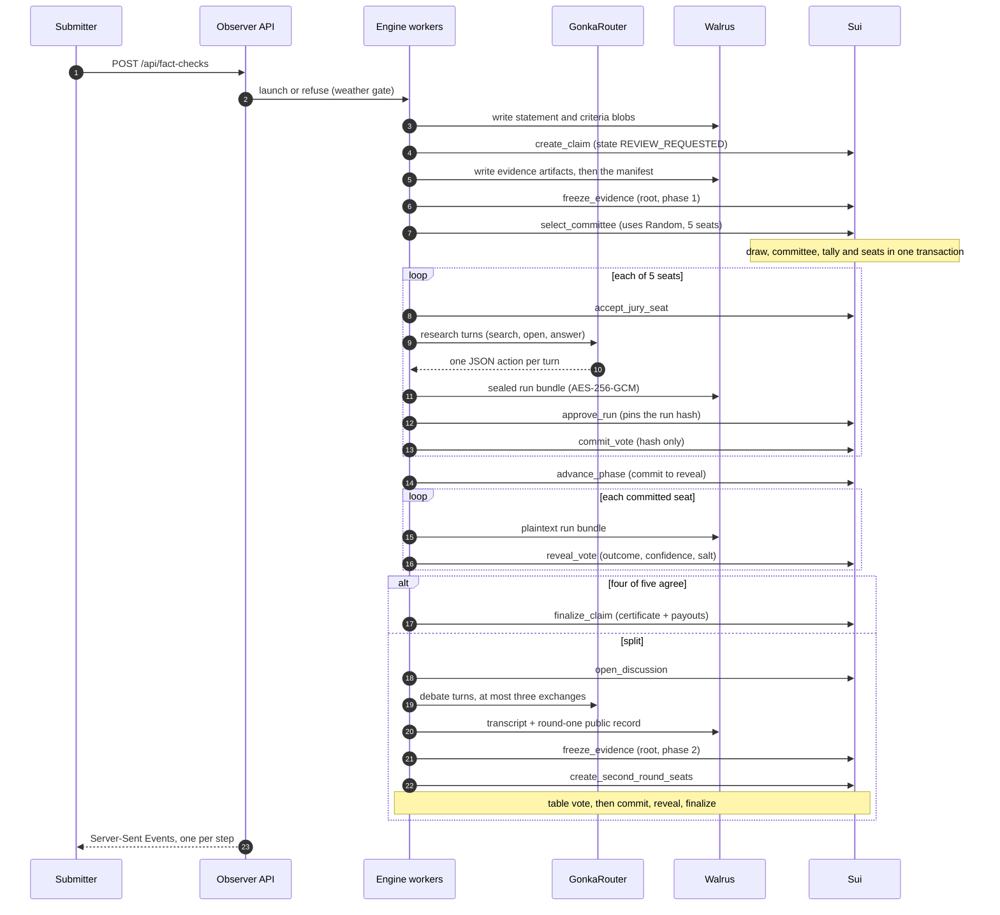
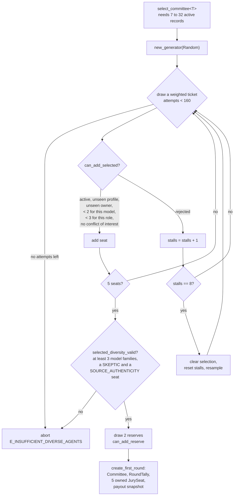
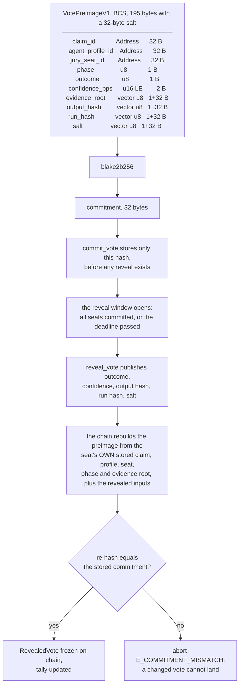
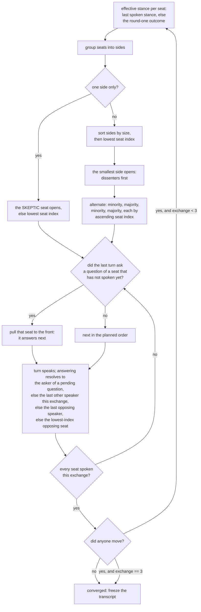
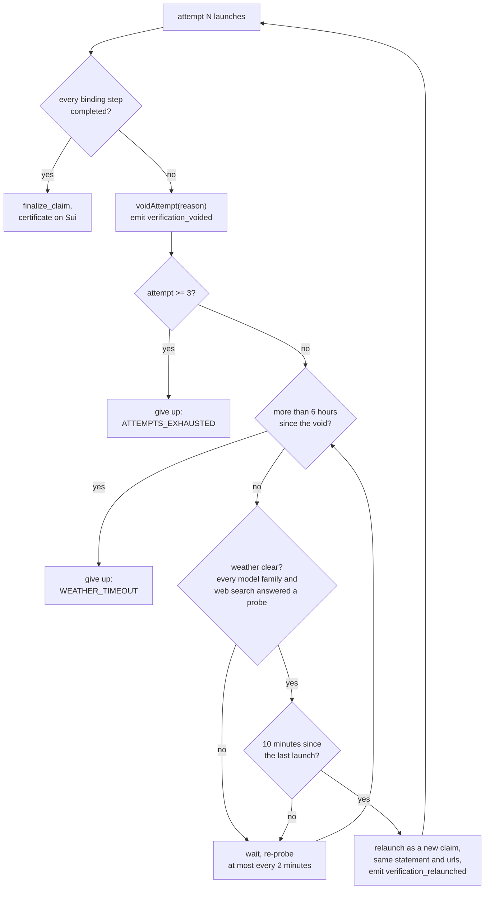

This page follows one verification from the moment a statement is submitted to
the moment a certificate is frozen on chain. Every stage names the file and the
identifier that implements it. Where the specification in `docs/PRD.md` and the
code disagree, this page follows the code and says so at the end.

A few words are used throughout. A **claim** is the statement being checked. A
**seat** is one place on the jury; the account that paid for it is the
**staker**, and the model that answers from it is the **juror**. A **phase** is
one voting round: phase one is the first sealed ballot, phase two the second. A
**hash** is a fixed-length fingerprint of some bytes. Change one byte and the
hash changes, so a published hash pins content that has not been published yet.
Full definitions are in the [glossary](glossary).

## The whole lifecycle at a glance


The claim's own state is a small integer on chain. These are the exact `u8`
codes, shared between the Move modules and `lib/protocol/constants.ts`. Neither
side may be renumbered alone.



The state machine, with the exact `u8` code beside each state. Source:
`move/openverdict/sources/claim.move:35-53` and `lib/protocol/constants.ts:2-59`.

**A public fact check takes the left path.** It is created directly in
`REVIEW_REQUESTED` and goes straight to a jury. The propose and challenge path
on the right is optimistic settlement: someone posts an answer with a bond, and
a jury only convenes if somebody disputes it.

## Who does what

Six parties touch one verification. Only two of them can write to the chain.



One attempt end to end. The submitter and the observer never write to Sui; the
engine holds the only signing keys, and every write it makes is a public event.

**The observer never signs anything.** It has no keys and no mutation endpoints
beyond two guarded public POSTs. Stop it and the CLI keeps working, because
everything an audit needs is on Sui and Walrus.

## 1. Claim creation and deadlines

A claim is created by one Sui transaction. Two entry points exist:

- `claim::create_claim<T>` is the general path. It splits the creator's budget
  into three vaults (creation, committee, evidence) and shares a `Claim<T>` in
  state `CREATED`.
- `demo_fact_checker::start_fact_check<T>` is the public fact-check path. It
  creates the claim, marks direct review requested and shares it in one
  transaction, so the claim is born in `REVIEW_REQUESTED`. Its budget is capped
  at `MAX_DIRECT_REVIEW_BUDGET`, one SUI.

The public HTTP entry is `POST /api/fact-checks`.

| Input limit | Value | Source |
| --- | --- | --- |
| `MIN_CLAIM_LENGTH` | 5 characters | `app/api/fact-checks/route.ts:8` |
| `MAX_CLAIM_LENGTH` | 1000 characters | `app/api/fact-checks/route.ts:9` |
| `MAX_TEXT_LENGTH` | 20000 characters | `app/api/fact-checks/route.ts:10` |
| `MAX_CRITERIA_LENGTH` | 2000 characters | `app/api/fact-checks/route.ts:11` |
| `MAX_URLS_COUNT` | 5 | `app/api/fact-checks/route.ts:12` |

When no resolution criteria are given, the engine supplies a default public
rubric: decide whether the statement is true as written as of the claim's
evidence cutoff, weigh evidence for and against from primary sources found by
the juror's own research, and answer YES or NO only when credible sources
agree.

**The statement never goes on chain as text.** What goes on chain is
`content_hash`, the blake2b-256 of the canonical JSON of the statement and the
resolution criteria, plus the Walrus blob ids of both. It must be exactly 32
bytes (`claim.move:455-461`).

### The deadline ladder

A claim carries seven deadlines on chain, and `claim::validate_params` requires
them to be strictly increasing and strictly after now, else it aborts with
`E_INVALID_DEADLINES`:

```
proposal < challenge < first_commit < first_reveal
        < discussion < second_commit < second_reveal
```

The whole ladder is capped by `MAX_TOTAL_DURATION_MS`, thirty days
(`claim.move:28`). The hosted offsets the engine uses, measured from the create
transaction, are set in `defaultDeadlines` at `lib/engine/engine.ts:6095-6105`:

| Deadline | Offset from creation | Window it opens |
| --- | --- | --- |
| Evidence cutoff (engine only, never on chain) | 60 s | |
| Proposal | 65 s | |
| Challenge | 70 s | |
| First commit | 600 s | 530 s of research |
| First reveal | 720 s | 120 s to reveal |
| Discussion | 1560 s | 840 s of debate |
| Second commit | 1800 s | 240 s for the table vote |
| Second reveal | 1920 s | 120 s to reveal |

A one-round verdict lands about twelve minutes after the submission, a
two-round claim about thirty-two minutes. The ladder is computed **after** the
statement and criteria are written to Walrus, not at request start, because
those writes take roughly thirty-five seconds on testnet.

Localnet uses a shorter ladder: evidence cutoff 45 s, proposal 50 s, challenge
55 s, first commit 360 s, first reveal 480 s, discussion 600 s, second commit
720 s, second reveal 840 s (`lib/engine/engine.ts:6037-6049`).

### The acceptance window

`ACCEPTANCE_WINDOW_MS` is 20000 ms (`jury.move:37`). A drawn seat has twenty
seconds from selection, clamped so it never exceeds the first commit deadline,
to accept or decline. `lock_committee` refuses before that window closes
(`E_DEADLINE_NOT_REACHED`) and after the first commit deadline
(`E_DEADLINE_PASSED`). Round two has no acceptance window: those seats are
created already accepted (`jury.move:706`).

## 2. The evidence freeze

Freezing evidence means: hash everything the jury may look at, publish the
hash on chain, and put the bytes where anyone can fetch them. After the freeze
the record cannot be edited without the hash changing.

`evidence::freeze_evidence<T>` is gated by an `EvidenceCap`, builds an
`EvidenceBundle`, links it to the claim, emits `EvidenceFrozen` and freezes the
object so it can never change. A second freeze for the same phase aborts with
`E_ALREADY_LINKED`.

**What Sui stores.** The bundle holds the claim id, the phase, a 32-byte
`root`, the manifest blob id and object id, the source count, the evidence
policy id and the Walrus end epoch. Nothing about an individual evidence item
reaches the chain.

**What Walrus stores.** The manifest JSON as
`evidence-<claimId>-<phase>.json`, plus the raw bytes and the canonical text of
every artifact, each referenced from the manifest by blob id and object id. A
page a juror discovered and opened is stored the same way, with
`sourceClass: "DISCOVERED"`.

### The evidence root, exactly

`computeEvidenceRoot` (`lib/evidence/manifest.ts:38-54`) is a binary Merkle
tree over blake2b-256 with 32-byte digests. A Merkle tree hashes pairs of
hashes up to one root, so a single root commits to every item beneath it.

1. **Sort.** Items are ordered by the UTF-8 bytes of `evidenceId`, compared
   byte by byte unsigned, with the shorter array first on a tie
   (`lib/evidence/manifest.ts:140-148`, `:184-191`).
2. **Leaf.** `blake2b256(BCS(EvidenceLeafV1 { evidence_id, content_hash, canonical_hash }))`,
   where `evidence_id` is the UTF-8 bytes of the id and both hashes are exactly
   32 bytes. There is no domain-separation prefix byte.
3. **Node.** `blake2b256(left || right)`, a plain 64-byte concatenation. **An
   odd node at a level is duplicated and paired with itself.**
4. **One leaf.** A single-item manifest's root is just `blake2b256(leaf)`, with
   no further hashing.
5. **Zero leaves** is an error, never an empty root.

A duplicate `evidenceId`, `contentHash` or `canonicalHash` is a hard error, and
a hash that is not 32 bytes is rejected.

The manifest JSON written to Walrus, from `lib/evidence/manifest.ts:69-74`:

```json
{
  "version": 1,
  "hashAlgorithm": "blake2b-256",
  "leafEncoding": "bcs::EvidenceLeafV1",
  "items": [ ... ]
}
```

Note this one uses `JSON.stringify`, not canonical JSON, so its byte order is
the declaration order above rather than sorted keys. The `items` array is in
the sorted-`evidenceId` order.

HTML is canonicalized to inert text before hashing, under
`HTML_CANONICALIZER_VERSION = "htmlparser2@12"`. Script, style, noscript,
iframe, object, embed and svg elements are dropped entirely
(`lib/evidence/canonicalize.ts:3-13`).

### Two freezes per claim

Phase one freezes the submitter's artifacts with the claim statement placed
first. Phase two runs the debate to completion, then adds two synthetic
artifacts on top of the phase-one set:

| Artifact | Canonical id | Source URL |
| --- | --- | --- |
| Round-one public record | `round-1-public-record:<claimId>` | `urn:openverdict:round-1-public-record` |
| Deliberation transcript | `deliberation-transcript:<claimId>` | `urn:openverdict:deliberation-transcript` |

Source: `lib/engine/engine.ts:216-220`, `:6263-6267`. An empty artifact set is
an error, not an empty freeze.

`DEFAULT_EVIDENCE_FREEZE_LEAD_MS` is 30000 ms, overridable by
`OPENVERDICT_EVIDENCE_FREEZE_LEAD_MS`. It is only a fallback bound: a debate
that converges or finishes its last exchange freezes immediately, and the lead
bites only when the discussion window runs out mid-debate.

## 3. The committee draw


`jury::select_committee<T>` draws the jury. It takes `&Random`, Sui's on-chain
randomness object, so the Move compiler requires it to be a private `entry fun`
and the builder keeps it as the last command in its transaction. The draw, the
`Committee`, the `RoundTally` and the five owned `JurySeat` objects are all
created inside that one call, so nobody ever sees a partial jury.

| Constant | Value | Source |
| --- | --- | --- |
| `COMMITTEE_SIZE` | 5 | `jury.move:43` |
| `RESERVE_COUNT` | 2 | `jury.move:44` |
| `REQUIRED_MATCHING` | 4 | `jury.move:45` |
| `MAX_SELECTION_DRAWS` | 160 | `jury.move:46` |
| `RESTART_AFTER_STALLS` | 8 | `jury.move:48` |
| `MAX_ELIGIBLE_SNAPSHOT` | 32 | `jury.move:49` |
| `MAX_ELIGIBLE_AGENTS` | 32 | `agent_registry.move:40` |

The registry must hold at least seven active records (five seats plus two
reserves) and at most thirty-two, otherwise the draw aborts with
`E_INSUFFICIENT_DIVERSE_AGENTS`. The ticket is weighted by stake: a staked
record registers at 10000 per 0.1 SUI posted, capped at 100000, so a 1 SUI seat
is drawn ten times as often as a 0.1 SUI one and nothing above that buys more.
Operator seats registered with `register_agent` carry the base weight of 10000.
See [Staking](staking) for the formula.



The draw is greedy and never backtracks. Source: `jury.move:233-311`,
`:1176-1236`, `:910-1040`.

### The diversity rules, in words

`can_add_selected` (`jury.move:1176-1186`) accepts a candidate only when it is
active, carries non-zero weight, is not already selected, does not share an
owner with a selected seat, holds fewer than two seats for its model family,
and holds fewer than three seats for its role:

- **One seat per operational signing key.** No two seats on a jury share an
  owner.
- **At most two seats per model family.**
- **At most three seats per role.**
- **At least three distinct model families** among the five, checked after the
  draw.
- **At least one SKEPTIC seat and at least one SOURCE_AUTHENTICITY seat.**
- **No cap per staker.** The staker-hash uniqueness rule was removed on
  2026-09-04. The comment in place reads: one seat per operational key, two per
  model, stakers are uncapped, because an address is free and a staker cannot
  influence a vote.
- A candidate whose owner is the claim creator, the proposer or the challenger
  is never drawn (`agent_conflicts_with_claim`, `jury.move:1188-1196`).

The two model-family numbers are not constants any more. `select_committee`
reads them from the registry, where the AdminCap holder can set them to
`(2, 3)` while a provider is down: two families, three seats each. That is
degraded mode, and it is never silent. The draw records the pair on the
committee it produced, so a replacement seat is judged by the same numbers the
draw used; it emits `jury::CommitteeDiversity` with the distinct model count,
the pair and a `degraded` flag; the operator's own change emits
`agent_registry::JuryDiversityChanged`; and the claim page, the report and
audit row S5 all say "2 model families (degraded mode)" from then on. Everything
else about the draw holds: five seats, one per signing key, a Skeptic and a
Source-authenticity seat, drawn by Sui's randomness. With the field never set,
`jury_diversity` answers the defaults `(3, 2)`, so a registry that has never
heard of degraded mode behaves exactly as this page describes.

Role hashes are fixed strings: `blake2b256(b"OPENVERDICT_ROLE_SKEPTIC")` and
`blake2b256(b"OPENVERDICT_ROLE_SOURCE_AUTHENTICITY")`
(`agent_registry.move:522-529`).

**The worked example's jury** shows all of this holding at once. The five seats
ran `deepseek-ai/DeepSeek-V4-Flash-0731`, `moonshotai/Kimi-K2.6`,
`MiniMaxAI/MiniMax-M2.7`, `deepseek-ai/DeepSeek-V4-Flash-0731` and
`MiniMaxAI/MiniMax-M2.7`: three distinct families, at most two seats each, five
distinct owners.

### Reserves, restarts and the feasibility guard

The two reserves must not share a profile or an owner with any selected seat or
with each other, must hold exactly the SKEPTIC or the SOURCE_AUTHENTICITY role,
and must not share a role with each other. Reserves carry no model cap.

Every rejected candidate increments a stall counter; after eight consecutive
stalls the partial selection is cleared and sampling continues from scratch.
Both loops share one attempt counter bounded by `MAX_SELECTION_DRAWS`.

`lib/engine/draw-feasibility.ts` mirrors these rules off chain so a stake can be
refused before any money moves. `rosterAdmitsDraw` searches exhaustively for any
valid five-seat committee; `rosterCanSeat` searches for a valid committee that
seats a specific candidate, and returns a plain-English reason when none
exists. Its mirrored constants are `COMMITTEE_SIZE = 5`, `RESERVE_COUNT = 2`,
`MAX_SEATS_PER_MODEL = 2`, `MAX_SEATS_PER_ROLE = 3`, `MIN_MODEL_FAMILIES = 3`
(`lib/engine/draw-feasibility.ts:22-30`).

If a seat declines, `replace_declined_seat` swaps in a reserve, but only while
the committee is unlocked, in phase one, before the first commit deadline, and
only if the replacement preserves the model cap, the three distinct families
and both required roles.

## 4. The research loop

Each seat runs an engine-executed loop. **The model never fetches anything.** It
emits one JSON action per turn, and the engine performs it and hands back the
result. That is what makes every page a juror saw reproducible: the engine
recorded it, not the model.

The three actions are `search`, `open` and `answer`. Since prompt spec v3 a
search must carry an intent of `"support"` or `"challenge"`; a search without
one is refused with the message `search needs "intent": "support" or "challenge"`.
Since v4 an open may name several URLs in one turn, fetched in parallel and
returned as a single tool result. Since v5 the output instructions carry a
worked example of a valid `answer` action and one line saying that
`evidenceFor`, `evidenceAgainst`, `unsupportedClaims` and `decisiveEvidence`
hold evidence ids only, never prose, so a juror stops sending a sentence where
the schema wants an array and the engine stops paying for the repair turn.

Tool error codes returned to the model: `BUDGET_SEARCHES`, `BUDGET_OPENS`,
`BUDGET_TURNS`, `URL_NOT_SEEN`, `OPEN_FAILED`, `SEARCH_FAILED`,
`INVALID_ACTION` (`lib/research/loop.ts:462`).

### The tool policy, by version

The tool policy is hashed into the juror's on-chain manifest, so the budgets a
run obeyed are part of the record and cannot be changed after the fact.

| Field | v2 | v3 | v4 |
| --- | --- | --- | --- |
| `maxSearches` | 3 | 4 | 4 |
| `maxOpens` | 4 | 5 | 5 |
| `maxTurns` | 8 | 10 | 10 |
| `resultsPerSearch` | 5 | 5 | 5 |
| `snippetChars` | 200 | 200 | 200 |
| `pageSliceChars` | 4000 | 4000 | 4000 |
| `maxPageChars` | 60000 | 60000 | 60000 |
| `maxLoopMs` | 600000 | 600000 | 600000 |
| `requireChallengeSearch` | absent | true | true |
| `minCitationDomains` | absent | 2 | 2 |
| `minOpensPerSide` | absent | 1 | 1 |
| `maxOpensPerTurn` | absent | absent | 3 |

Source: `lib/gonka/promptSpec.ts:84-95` (v2), `:134-149` (v3), `:165-169` (v4).
Prompt spec v5 runs on the same v4 policy, so the table stops at v4.
Every spec runs at temperature 0 with a 4096-token output cap and a
`json_object` response format. The engine refuses to run a seat whose stored
manifest hashes differ from its published document.

### The two-sided rules

Four rules stand between a model and a YES or a NO. Each may be enforced by at
most two refusals (`MAX_RESEARCH_NUDGES = 2`), and none applies to UNSURE.

| Rule | What it requires | Refusal code |
| --- | --- | --- |
| Research required | A search-origin page was opened before answering YES or NO | `RESEARCH_REQUIRED` |
| Challenge required | At least one completed challenge search, and when it returned results, one of those results opened | `CHALLENGE_REQUIRED` |
| Corroboration required | Found, search-origin citations span at least `minCitationDomains` distinct sites (two under v3 and v4) | `CORROBORATION_REQUIRED` |
| Counter-evidence summary | Non-empty for YES or NO. A validation error, not a nudge | none |

Source: `lib/research/loop.ts:1080-1186`.

A quote is checked by normalizing both sides and testing for a substring, and
the auditor recomputes the same function (`lib/research/citations.ts:56-60`). A
seat that cannot produce a valid citation after two answer repairs fails closed
with status `CITATION_INVALID`. The other failure statuses are
`INVALID_SCHEMA`, `TIMEOUT` and `PROVIDER_ERROR`
(`lib/protocol/types.ts:89-95`).

Provider retries: `MAX_PROVIDER_RETRIES = 12`, backoff
`[5000, 10000, 20000, 30000]` ms, and never a retry that cannot finish before
the seat deadline (`MIN_RETRY_CALL_MS = 20000`).

### The research transcript

`ResearchTranscriptV1` (`lib/protocol/types.ts:603-617`):

```
{ version: 1, runId, provider: { name, mode }, policyHash,
  steps[], opened[], citations[] (each with a `found` boolean),
  counts: { searches, opens, turns, challengeSearches? } }
```

Its hash is `blake2b256(canonicalJson(transcript))`
(`lib/research/transcript.ts:20-22`). A page the juror discovered gets a
derived id: `blake2b256("discovered:<claimId>:<phase>:<normalizedUrl>")`.

### The sealed run bundle

A **run bundle** is the complete record of one juror's turn: what it was asked,
what it did, what it answered. It is encrypted before the vote is committed, so
the reasoning cannot influence another juror, and published in the clear at the
reveal.

`buildRunBundleCore` (`lib/engine/runBundle.ts:60-145`) writes, in order:
`kind: "run-bundle"`, `runId`, `claimId`, `phase`, `agentProfileId`,
`jurySeatId`, `promptSpec`, `promptHash`, `toolPolicy`, `toolPolicyHash`,
`transcript`, `input`, `inputHash`, `request` (the exact message list),
`attempts` (every visible provider attempt, hedges included), `rawResponse`,
`gateway` (request ids, devshard, fingerprint), `validatedOutput`,
`outputHash`, `audit`, `runHash`, and a `verify` recipe block naming each
formula literally.

| Bundle version | Used by | Difference |
| --- | --- | --- |
| below 3 | legacy runs | no tool policy hash, no system prompt check |
| 3 | prompt spec v2 | full research bundle |
| 4 | prompt spec v3 | adds the challenge and corroboration fields |
| 5 | prompt spec v4 or v5 | adds `maxOpensPerTurn` |
| 6 | table vote v1 | **no** `toolPolicy`, no `toolPolicyHash`, no `transcript` |

Sealing uses **AES-256-GCM** with a fresh 32-byte key and a 12-byte
initialization vector, with the run id as additional authenticated data, and
records `coreHash = blake2b256(canonicalJson(core))`. Before the commit only
the ciphertext is on Walrus, cited by `approve_run` as both `run_blob_id` and
`tool_blob_id`. At the reveal the plaintext core plus the key is published as
the reveal argument blob (`lib/engine/runBundle.ts:194-231`,
`lib/engine/engine.ts:2722-2744`, `:1772-1824`).

A seat that fails still leaves a public record: an `InferenceFailureV1`
document with its status, message, failure time, the transcript at that moment
and every attempt.

### Canonical JSON, exactly

Several hashes are taken over canonical JSON, so a reproducer must serialize
identically. `canonicalJsonString` (`lib/gonka/canonical.ts:43`):

| Rule | Behaviour |
| --- | --- |
| Object keys | `Object.keys(record).sort()`, lexicographic over UTF-16 code units, applied recursively |
| Arrays | Order preserved exactly, never sorted |
| Numbers | `JSON.stringify`, the shortest round-trip form. `NaN` and infinities throw. `-0` becomes `0` |
| Strings and keys | Standard JSON escaping via `JSON.stringify` |
| `null` | The literal `null` |
| `undefined` | **Throws.** Producers omit optional keys rather than assigning undefined |
| Non-plain objects | Throw. No `Date`, no class instances, no `Map`, no typed arrays |
| Cycles | Throw |
| Whitespace | None at all |

Pinned example (`lib/gonka/canonical.test.ts:11-13`):

```
canonicalJsonString({ z: 1, a: { y: true, x: [3, { b: 2, a: 1 }] } })
  === '{"a":{"x":[3,{"a":1,"b":2}],"y":true},"z":1}'
```

### What the run hash covers

`computeRunHash` is `blake2b256(BCS(RunRecordV1))`. BCS is Sui's binary
serialization: fields are concatenated in declaration order with no tags, so
the order **is** the contract.

| # | Field | BCS type | Encoded size |
| --- | --- | --- | --- |
| 1 | `run_id` | `Address` | 32 |
| 2 | `claim_object_id` | `Address` | 32 |
| 3 | `agent_profile_id` | `Address` | 32 |
| 4 | `jury_seat_id` | `Address` | 32 |
| 5 | `phase` | `u8` | 1 |
| 6 | `attempt` | `u16` | 2 little-endian |
| 7 | `provider_id` | `string` | ULEB128 length, then UTF-8 |
| 8 | `model_id` | `string` | ULEB128 length, then UTF-8 |
| 9 | `gonka_request_id` | `string` | ULEB128 length, then UTF-8 |
| 10 | `prompt_hash` | `vector<u8>` | 1 + 32 |
| 11 | `input_hash` | `vector<u8>` | 1 + 32 |
| 12 | `output_hash` | `vector<u8>` | 1 + 32 |
| 13 | `tool_transcript_hash` | `vector<u8>` | 1 + 32 |
| 14 | `evidence_root` | `vector<u8>` | 1 + 32 |
| 15 | `requested_at_ms` | `u64` | 8 little-endian |
| 16 | `completed_at_ms` | `u64` | 8 little-endian |

Source: `lib/protocol/bcs.ts:20-37`, built at `lib/engine/engine.ts:2669-2687`.

For a table vote the transcript is null and `tool_transcript_hash` is
`EMPTY_TOOL_TRANSCRIPT_HASH`, which is `blake2b256` over a **one-byte preimage
whose single byte is `0x00`** (`lib/gonka/audit.ts:13-15`). It is not the hash
of an empty string and not a zero constant.

Because `prompt_hash` sits inside the run hash, and the prompt hash is pinned
in the on-chain juror manifest, the prompt spec and, through the transcript's
policy hash, the tool policy are both bound to the vote that lands on chain.

## 5. Commit and reveal

Commit-reveal means each juror publishes a hash of its vote first and the vote
itself later. Nobody can read a sealed vote, and nobody can change one after
the fact, because the revealed vote must reproduce the published hash.



Commit-reveal. The chain rebuilds the preimage from fields the juror cannot
touch, so only the vote itself is taken on trust, and only until it is checked.
Source: `lib/protocol/bcs.ts:6-17` and
`move/openverdict/sources/jury.move:161-172`, held byte-identical by parity
tests on both sides.

### The preimage, field by field

| # | Field | BCS type | Notes |
| --- | --- | --- | --- |
| 1 | `claim_id` | `Address` | 32 raw bytes, no length prefix |
| 2 | `agent_profile_id` | `Address` | 32 raw bytes |
| 3 | `jury_seat_id` | `Address` | 32 raw bytes |
| 4 | `phase` | `u8` | 1 or 2 |
| 5 | `outcome` | `u8` | 1 YES, 2 NO, 3 UNSURE |
| 6 | `confidence_bps` | `u16` | little-endian, 0 to 10000 |
| 7 | `evidence_root` | `vector<u8>` | ULEB128 length `0x20`, then 32 bytes |
| 8 | `output_hash` | `vector<u8>` | same shape |
| 9 | `run_hash` | `vector<u8>` | same shape |
| 10 | `salt` | `vector<u8>` | 32 random bytes from the engine |

A `vector<u8>` is a ULEB128 length prefix followed by the raw bytes: `0x20` for
32 bytes, and `0x80 0x01` for 128. `Address` carries no prefix at all.

The commitment is `blake2b256` of those bytes, that is BLAKE2b unkeyed with no
salt and no personalization and a 32-byte digest, exactly matching
`sui::hash::blake2b256`. The chain requires the submitted commitment to be
exactly 32 bytes.

**The salt is what makes a commitment unguessable.** Without it, an outsider
could hash all three outcomes at every confidence and read the sealed vote off
the chain. It is 32 random bytes generated by the engine, published only in the
reveal transaction, and stored nowhere public before that.

Because the run hash is itself the hash of the run record, a commitment
transitively binds the prompt hash, the input hash, the tool transcript hash,
the model id and the gateway request id.

**Parity is enforced, not assumed.** Six pinned vectors are asserted
byte-identical by both `lib/protocol/parity.test.ts` and
`move/openverdict/tests/parity_tests.move`. A serialization change on either
side breaks exactly one suite.

### On chain

`commit_vote` consumes a matching `RunApproval`, copies its run hash onto the
seat, stores only the commitment, and moves the seat to `SEAT_COMMITTED`. It
requires an accepted seat, a bound non-empty evidence root
(`E_EVIDENCE_NOT_BOUND`), and a time at or before the seat's commit deadline.

`reveal_vote` requires the seat capability, the sender to be the seat's agent
owner (`E_NOT_AGENT_OWNER`), a committed seat, a valid outcome, a confidence at
most 10000 basis points, 32-byte output and run hashes, a non-empty salt and
argument blob id, an unexpired Walrus epoch, and an open reveal window. It then
rebuilds the preimage from the seat's **own stored** claim id, profile id, seat
id, phase and evidence root, and aborts with `E_COMMITMENT_MISMATCH` unless the
recomputed hash equals the stored commitment. A changed vote simply cannot
land.

The reveal window opens as soon as every seat has committed, not only at the
commit deadline.

## 6. Quorum

**Four matching reveals out of five.** `REQUIRED_MATCHING` is 4 and
`COMMITTEE_SIZE` is 5. `jury::threshold_outcome` returns YES, NO or UNSURE when
that outcome has at least four reveals, and zero otherwise
(`jury.move:758-768`).

Three places consume the rule:

- `settlement::finalize_claim` aborts with `E_FIRST_ROUND_NO_CONSENSUS` when a
  phase-one tally has no threshold, so a split first round cannot be finalized
  and must go to the table.
- `jury::open_discussion` requires that round one reached no threshold, else
  `E_CONSENSUS_REACHED`.
- `jury::create_second_round_seats` repeats that check.

So a settled claim can never be dragged into a debate, and a split claim can
never be forced into a yes or a no.

## 7. The debate

A split first round opens a debate. It is deliberation spec V4 by default;
`selectedDeliberationSpec` returns V3 only when `OPENVERDICT_DELIBERATION_SPEC`
is exactly `"3"` (`lib/engine/engine.ts:279`).

`MAX_DELIBERATION_EXCHANGES` is 3. An **exchange** is one full pass in which
every debater speaks exactly once. The per-turn budget is 60000 ms. The
debaters are the seats that actually revealed in round one.

### Convergence

`debateConvergedAfterExchange` walks exchanges 1, 2 and 3 and compares each
seat's stance in that exchange against its previous stance, using the round-one
outcome as the baseline for exchange 1. The first complete exchange in which
every comparable seat kept its stance is the convergence point. When that
equals the exchange just finished, the loop emits `debate_converged` once and
stops. The transcript is then frozen immediately, not at the discussion
deadline.

### The V4 conversation format

The output contract is exactly eight keys and no others
(`lib/gonka/promptSpec.ts:310-338`).

| Field | Rule | Bound |
| --- | --- | --- |
| `answering` | The seat index this turn answers. Null only when the turn opens the debate. | |
| `theirPoint` | One sentence restating that seat's specific claim, citation or inference. Empty exactly when `answering` is null, never empty otherwise. | 240 chars |
| `analysis` | Non-empty plain text, no markdown: what the speaker makes of that point against the record, conceding what holds and disputing what does not, naming the citations meant. | 900 chars |
| `question` | One pointed question to a named seat, as `{seat, text}`, or null. Never the speaker's own seat. | 240 chars |
| `position` | Non-empty, and it comes after the analysis: hold, raise, lower or change, and why. | 240 chars |
| `stance` | YES, NO or UNSURE. Public and non-binding. | |
| `confidenceBps` | Integer 0 to 10000. | |
| `citations` | Copied exactly from `allowedCitations`. | at most 8 unique |

Bounds live at `lib/engine/engine.ts:269-272`; the citation cap at `:226`. The
spec runs at temperature 0 with a 1100-token output cap. The stored turn also
keeps an `argument` field composed as the analysis and the position joined by a
space, so transcripts from earlier spec versions keep hashing identically.

A turn that breaks the contract is recorded as `SKIPPED` with the reason naming
the broken part: `INVALID_OUTPUT`, `INVALID_LENGTH`, `INVALID_ANSWERING`,
`INVALID_QUESTION`, `INVALID_CITATIONS`, plus `PROVIDER_ERROR`, `TIMEOUT` and
`WINDOW_EXHAUSTED`. **A skipped turn is a silent seat, never a repaired one,
and it is not a binding step: it never voids the attempt.**

### The speaking order

`lib/engine/debateOrder.ts` is a pure function of the seats and the turns
already persisted, so a restarted worker rebuilds the identical conversation.



The speaking order and the question hand-off, deliberation spec V4. Source:
`lib/engine/debateOrder.ts:55-240` and `lib/engine/engine.ts:4920-5009`.

Two details the diagram compresses. A question aimed at a seat that already
spoke is **carried** and delivered on that seat's next turn. And if a sibling
process spoke for the same seat or ordinal while the model was running, the
turn is dropped and the order re-planned, so two workers can never double-speak
a seat.

## 8. The table vote

Round two is not a second research pass. It is one sealed, **no-tools** vote per
juror over what is already on the table.

- The prompt is `TABLE_VOTE_PROMPT_SPEC_V1`, temperature 0, 2048 output tokens,
  JSON object response. Its system prompt says plainly not to request or use
  tools, not to search, open pages or fetch URLs.
- The message list is exactly the system prompt and the canonical JSON input.
  No budget block is appended, unlike a research run.
- The output contract has nine keys and no `citations` key. Evidence is
  referenced by evidence id only, from the phase-two manifest.
- The input carries the phase-two evidence manifest, the round-one public
  record, the full debate with every seat's stance, and the juror's own
  round-one output.
- The bundle is version 6: no tool policy, no transcript, and a fixed
  `tool_transcript_hash`.
- The seat's manifest document must be version 6 and its table-vote prompt hash
  must equal the pinned hash.

| | Round one | Round two |
| --- | --- | --- |
| Tools | search and open, budgets 4 / 5 / 10 | none |
| New research | yes, engine-executed | none |
| Prompt spec | research v2 to v4 | table vote v1 |
| Bundle core version | 3, 4 or 5 | 6 |
| Transcript | full research transcript | absent |
| `citations` key | required | forbidden |
| Manifest document | v3 to v6 accepted | v6 required |
| Seat status at creation | offered, must accept | already accepted |
| Output tokens | 4096 | 2048 |

On chain the round is identical: `create_second_round_seats` mints five
phase-two seats for the same profiles, then the same commit, reveal and
four-of-five threshold apply. Round two opens on the phase-two evidence bundle
being linked, which is the frozen transcript, not at the discussion deadline.

## 9. The certificate and the Truth Score

### The formula

The Truth Score is one number from 0 to 10000 basis points. It is the mean of
each valid reveal's **truth probability**: how likely that juror thinks the
statement is true.

```
per vote:  YES     -> confidence_bps
           NO      -> 10000 - confidence_bps
           UNSURE  -> 5000

score_bps = (sum + floor(count / 2)) / count      integer division
```

Adding `floor(count / 2)` before dividing is integer rounding half up. Votes
are unweighted, one per seat. Zero valid reveals yields no score at all rather
than a fabricated one. Only the terminal valid round is scored, and an
unchallenged optimistic finalization carries no score. Source:
`jury.move:771-779` and `lib/protocol/truthScore.ts:10-36`.

### Worked, on the real claim

The five jurors on claim `0x2732...4ac6` all voted NO, at these confidences:

| Seat | Outcome | Confidence (bps) | Truth probability (bps) |
| --- | --- | --- | --- |
| `0x445258...4637` | NO | 9500 | 10000 - 9500 = 500 |
| `0x6a5ec6...70db` | NO | 10000 | 10000 - 10000 = 0 |
| `0x844861...9e2f` | NO | 10000 | 0 |
| `0xc5e4ac...87d3` | NO | 9500 | 500 |
| `0xdef6df...e01c` | NO | 10000 | 0 |

```
sum   = 500 + 0 + 0 + 500 + 0 = 1000
count = 5
score = (1000 + floor(5 / 2)) / 5 = (1000 + 2) / 5 = 1002 / 5 = 200
```

The certificate on Sui carries `truth_score_bps = 200`, and the report displays
`200 / 100 = 2.00`. A score near 0 means the jury is confident the statement is
false; near 100, confident it is true; near 50, genuinely unsure.

### The Resolution Certificate

`ResolutionCertificate` is created and immediately frozen, so it is immutable
(`jury.move:148-158`, `:883-908`).

| Field | Type |
| --- | --- |
| `claim_id` | `ID` |
| `package_version` | `u64` |
| `result` | `u8`: 1 YES, 2 NO, 4 UNRESOLVED |
| `truth_score_bps` | `Option<u16>` |
| `committee_id` | `Option<ID>` |
| `evidence_bundle_ids` | `vector<ID>`, phase one then phase two |
| `revealed_vote_ids` | `vector<ID>` from the terminal tally |
| `finalized_at_ms` | `u64` |

A threshold of UNSURE, or phase two with no threshold at all, both become
`RESULT_UNRESOLVED`. Otherwise the result is the threshold outcome.

Finalizing requires the right reveal state, a passed reveal deadline or all
seats revealed, a locked committee, a tally that matches the committee, the
claim and the evidence bundle, and an unexpired Walrus retention.

Payout tickets are minted at the same time, one per reason: 1 creator refund,
2 jury reward, 3 proposer win, 4 challenger win, 5 proposer refund, 6
challenger refund, 7 cancelled, 8 protocol fee. A jury reward goes to the
seat's recorded staker, falling back to the operational owner for a seat that
predates staking.

## 10. Attempts

### All or nothing

Any seat failing a **binding step** voids the whole verification attempt.
Nothing partial is ever finalized, and no vote is ever invented for a failed
seat.

| Void reason | Trigger | Source |
| --- | --- | --- |
| `MISSING_COMMITTEE` | The claim was still in `REVIEW_REQUESTED` at the first commit deadline, so no committee can ever be drawn | `workers/resolution-worker.ts:177-183` |
| `MISSING_COMMIT` | Not all expected seats committed by the phase's commit deadline | `workers/resolution-worker.ts:194-200` |
| `MISSING_REVEAL` | Not all expected seats revealed by the phase's reveal deadline | `workers/resolution-worker.ts:225-231` |
| `INVALID_SCHEMA` | A run produced no valid output | `lib/engine/engine.ts:3897-3903` |
| `CITATION_INVALID` | Citation rules unmet after the nudges and repairs | same |
| `TIMEOUT` | The run did not finish in its budget | same |
| `PROVIDER_ERROR` | The gateway failed the run | same |

A voided attempt simply lapses on chain without a certificate: there is no
mid-flight cancel, since `settlement::cancel_claim` only accepts a claim still
in `CREATED`.

### The attempt ladder



The attempt ladder: at most three attempts, and a relaunch only when the models
are demonstrably answering. Source: `lib/engine/engine.ts:822-932`.

**The weather gate** exists because a jury with no web search answers UNSURE on
everything. The engine probes the three model families and the research
provider together. A report is marked stale after five minutes, and it is clear
only when it is fresh and every family answered. A submission arriving under
clear or stale weather launches immediately; under fresh bad weather it is
refused outright, with a 503 carrying the weather report and a `Retry-After`
header, and nothing is stored. "Every family" means every family that still
holds an active seat on the registry, and there have to be at least as many of
them as the draw requires: in degraded mode two active families that both
answer are enough, and a family with no active seat left cannot hold a jury
up. There is no queue: the submitter decides when to send it again.
Relaunches of voided attempts are spaced at one every ten minutes, because
three concurrent juries drew a rate-limit storm from the shared gateway on
2026-09-03.

## 11. Every timing constant

| Constant | Value | Where |
| --- | --- | --- |
| `ACCEPTANCE_WINDOW_MS` | 20000 ms | `move/openverdict/sources/jury.move:37` |
| `MAX_TOTAL_DURATION_MS` | 2592000000 ms (30 days) | `move/openverdict/sources/claim.move:28` |
| `WITHDRAWAL_DELAY_MS` | 86400000 ms (24 hours) | `move/openverdict/sources/agent_registry.move:42` |
| `DEFAULT_EVIDENCE_FREEZE_LEAD_MS` | 30000 ms | `lib/engine/engine.ts:225` |
| `MAX_DELIBERATION_EXCHANGES` | 3 | `lib/engine/engine.ts:229` |
| `MAX_VERIFICATION_ATTEMPTS` | 3 | `lib/engine/engine.ts:231` |
| `PER_TURN_BUDGET_MS` | 60000 ms | `lib/engine/engine.ts:221` |
| `SEAT_COMMIT_MARGIN_MS` | 60000 ms | `lib/engine/engine.ts:5817` |
| `COMMIT_PUMP_INTERVAL_MS` | 5000 ms | `lib/engine/engine.ts:5819` |
| `RELAUNCH_GIVE_UP_MS` | 21600000 ms (6 hours) | `lib/engine/engine.ts:235` |
| `RELAUNCH_PROBE_TIMEOUT_MS` | 60000 ms | `lib/engine/engine.ts:237` |
| `RELAUNCH_WEATHER_CACHE_MS` | 120000 ms | `lib/engine/engine.ts:233` |
| `WEATHER_PROBE_INTERVAL_MS` | 120000 ms | `lib/engine/engine.ts:239` |
| `WEATHER_STALE_MS` | 300000 ms | `lib/engine/engine.ts:241` |
| `RELAUNCH_SPACING_MS` | 600000 ms (10 minutes) | `lib/engine/engine.ts:253` |
| `RESEARCH_PROBE_TIMEOUT_MS` | 15000 ms | `lib/engine/engine.ts:245` |
| `STAKE_RESERVATION_TTL_MS` | 900000 ms (15 minutes) | `lib/engine/engine.ts:209` |
| `maxLoopMs` | 600000 ms | `lib/gonka/promptSpec.ts:95`, `:145` |
| `MIN_RETRY_CALL_MS` | 20000 ms | `lib/research/loop.ts:249` |
| `NO_EVIDENCE_GRACE_MS` | 60000 ms | `workers/evidence-worker.ts:13` |
| Worker polling | 2 s busy, 15 s idle, plus a wake file | `workers/runtime.ts` |

## Where the code corrects the specification

Four numbers in `docs/PRD.md` and the older design specs are out of date. The
code is the truth:

- The hosted deadline ladder is 600 / 720 / 1560 / 1800 / 1920 seconds, not the
  450 / 570 / 1410 / 1650 / 1770 the specs describe.
- The evidence freeze lead is 30 seconds, not 120, and it is a fallback rather
  than the normal path.
- The acceptance window is 20 seconds, not 60 and not the midpoint of the
  commit window.
- The draw has no per-staker cap. `docs/PRD.md` contradicts itself here, and
  the later addendum item is the accurate one.
