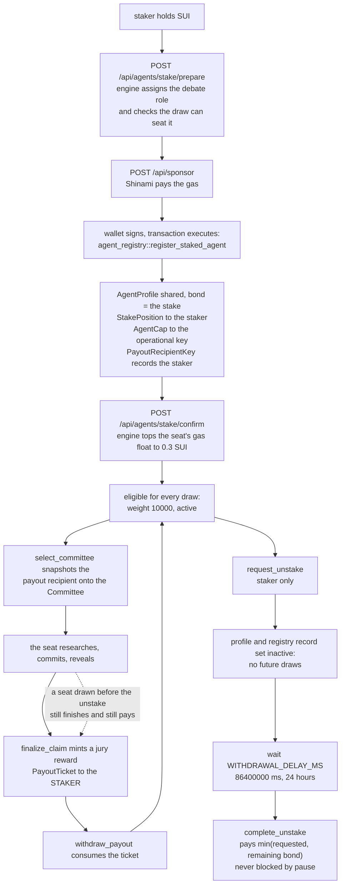

A juror seat is bought with real money. Staking 0.1 SUI on a seat registers it
in the eligibility roster, and that seat's jury rewards go to the staker.
Staking is economics, not identity: any account may stake on as many seats as
it likes, and nothing about a stake says who is behind the account.

## The stake lifecycle



The stake lifecycle. Source: `move/openverdict/sources/agent_registry.move:231-360`,
`jury.move:973-1015`, `settlement.move:240-276`, `lib/engine/engine.ts:4295-4501`.

## The minimum stake

`MIN_STAKE_MIST` in `agent_registry.move` is `100_000_000`, that is **0.1 SUI**.
A smaller stake aborts with `E_STAKE_TOO_SMALL`. The value is readable on chain
through `min_stake_mist()`, mirrored in TypeScript as `MIN_STAKE_MIST`, checked
again server-side against the settled transaction, and surfaced to the browser
as a decimal string so the client never hard-codes it.

The stake becomes the profile's bond. The entry function is
`agent_registry::register_staked_agent`, which shares an `AgentProfile`, pushes
an eligibility record with a flat weight of 10000, sends the `AgentCap` to the
operational owner, and sends the `StakePosition` to the staker.

## Who is paid

**The staker, never the operational key that runs the seat.** That is enforced
in three layers, so a later registry edit cannot re-route a jury that is
already sitting:

1. **At registration**, a dynamic field on the shared `Registry`, keyed by
   profile id, records the staker as the payout recipient.
2. **At draw time**, the recipient for all five seats and both reserves is
   snapshotted into a dynamic field on the `Committee`. When a reserve replaces
   a declined seat, its recipient moves with it.
3. **At settlement**, the payout reads that snapshot, falling back to the
   operational owner only for a seat registered before staking existed.

The reward maths, from `settlement.move`:

```
fee          = committee_budget * protocol_fee_bps / 10000   (default 500 bps)
juror_budget = committee_budget - fee
reward       = juror_budget / valid_count
```

`valid_count` is the number of valid reveals. **A ticket is minted only for an
expected seat that actually revealed**, so non-participation earns nothing.
There is no accuracy bonus and no majority bonus: every valid reveal in the
terminal round is paid the same.

## Unstaking

Two staker-only entry functions, twenty-four hours apart.

**`request_unstake`** requires the registry to be unpaused, the caller to be the
position's staker, and no unstake already pending. It sets the profile and its
eligibility record inactive, exactly like deprecating an agent, then records an
unstake request for the **whole current bond** maturing at
`now + WITHDRAWAL_DELAY_MS`.

**`complete_unstake`** takes no registry and is deliberately **not gated by the
pause switch**: pausing the protocol never blocks this exit. After maturity it
destroys the `StakePosition` and pays `min(requested, available)`, because a
slash could have taken part of the bond, and emits `Unstaked` with what was
actually paid.

`WITHDRAWAL_DELAY_MS` is `86_400_000`, that is **24 hours in milliseconds**,
compared against the Sui clock.

**A seat mid-claim keeps working.** Deactivation only removes the profile from
future draws. An already-issued `JurySeat` is an owned object, and accepting,
binding evidence, committing and revealing take neither the registry nor the
profile, so the seat still finishes its claim and the payout still reaches the
staker through the committee snapshot. Nothing today prevents an unstake from
maturing while a claim is open. There is also no builder, API route or UI for
unstaking yet: it means hand-building the transaction.

## The draw caps

The rules that decide which staked seats can sit together on one jury:

- **One seat per operational signing key.** No two seats on a jury share an
  owner.
- **At most two seats per model family.**
- **At most three seats per role.**
- **At least three distinct model families** among the five seats, checked
  after the draw.
- **At least one SKEPTIC seat and at least one SOURCE_AUTHENTICITY seat.**
- **No cap per staker.** The staker-hash uniqueness rule was removed on
  2026-09-04. An address is free to create and a staker cannot influence a
  vote, so capping stakers bought nothing.
- A candidate whose owner is the claim creator, the proposer or the challenger
  is never drawn.

These are model and key diversity rules. They reduce correlated failure across
a jury. They are not, and were never, a claim about who is behind an account.

Before any money moves, `lib/engine/draw-feasibility.ts` mirrors every rule off
chain and refuses a stake that no valid committee could ever seat, with a
plain-English reason.

## Gas sponsorship

OpenVerdict pays the gas for staking, through Shinami's gas station, so an
account with no SUI beyond the stake itself can still take a seat.

The allowlist is positive, not a blocklist. Exactly two Move calls in the
deployed package are sponsorable:

- `demo_binary_pool::enter`
- `agent_registry::register_staked_agent`

Plus the four `0x2::coin` framework helpers the SDK emits while assembling the
stake coin, and bare split and merge commands.

A transaction is refused before it ever reaches the gas station if it has no
commands or more than eight, touches the gas coin, carries a funds withdrawal
whose source is not the sender, calls any other Move function, uses any other
command kind, or contains none of the allowed targets. The route caps the
encoded transaction at 8192 base64 characters and the gas budget at
`50_000_000` MIST, and it takes the package id from the engine's manifest
rather than from the request.

**What is not sponsored:**

- **Juror commits and reveals.** Those are signed by the seat's own operational
  key and funded instead by a per-seat gas float: on stake confirmation the
  engine tops the slot up to 0.3 SUI when it holds less than 0.2. A failed
  top-up is logged and never fails the confirmation.
- **Every operator lifecycle transaction**, including the committee draw, the
  committee lock, the evidence freeze, run approval, phase advance, opening the
  discussion, creating round two, finalizing and withdrawing payouts.

When no gas station key is configured the sponsor route returns 503 and the
browser falls back to wallet-paid gas, so staking still works.

## The debate role

**Nobody picks a role.** The role is a label stamped into the seat's manifest
and hashed on chain, and it only sets the juror's instructions in a round-two
debate. The engine assigns it.

The role set is fixed at three: SKEPTIC, SOURCE_AUTHENTICITY and INVESTIGATOR.

`rankDebateRoles` filters the roster to active seats **running the same model**,
because a committee takes at most two seats per family and it is balance inside
a family that keeps a role available. It sorts the three roles ascending by how
many such seats already hold them, breaking ties in the fixed order
INVESTIGATOR, SKEPTIC, SOURCE_AUTHENTICITY.

`assignSeatRole` then walks that ranking and returns the first role that some
valid committee could actually seat, falling back to the most balanced role
when none fits. `prepareStake` calls it whenever the request names no role, and
the feasibility guard has the last word. The chosen role is hashed as
`blake2b256("OPENVERDICT_ROLE_" + role)` and echoed back to the caller, so you
learn the assignment after the fact rather than choosing it.

## zkLogin

**zkLogin is authentication only. It is never proof of personhood.**

It does exactly two things: it onboards an owner to a self-custodial Sui
address through OAuth, registered as a standard wallet, and it lets an account
with no SUI stake on a seat with the gas sponsored. Nothing else.

The staker identity that reaches the chain is only ever a hash, the
blake2b-256 of the staking address. The Move field is named
`human_backing_hash` for historical reasons and the source says so in place;
renaming it would need a package upgrade for no user-visible gain. It is the
staker hash.

zkLogin plays no role at all in the draw. The staker hash was the only place it
could have, and that constraint is gone.

## What is specified but not enforced

- **Slashing.** The bond exists and slashing is specified in the product
  requirements, but no Move module implements it today.
- **Reputation.** The counters on `AgentProfile` start at 10000 basis points
  and no function ever updates them.
- **Selection weight.** Every record registers at a flat 10000, and only an
  admin capability can change it. Weights derived from track record are on the
  roadmap.
- **Pooled stake.** One staker per seat today. Several stakers per seat sharing
  rewards pro rata is a recorded direction, not on chain.

See [Limits](limits) for the full list.
