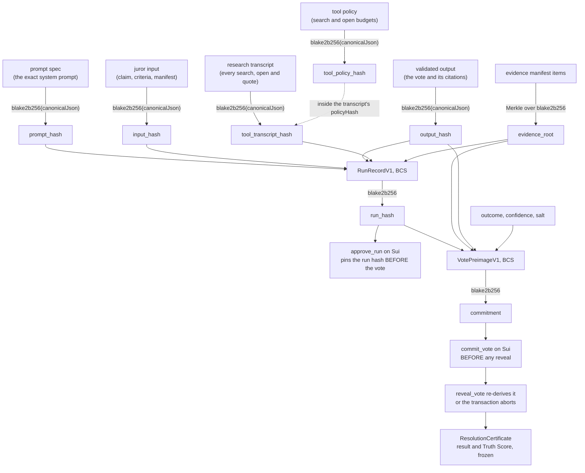

OpenVerdict certifies a process, not universal truth. This page says exactly
which parts of that process anyone can check from public data, which parts rest
on the operator, and where the boundary between the two runs.

The short version: **the operator is detectable, not impossible.** It cannot
forge the record without breaking a hash anyone can recompute. It can decide
what to run and when.

## The hash chain

Everything below hangs off one idea. A hash is a fixed-length fingerprint of
some bytes. Publishing a hash first pins content that is published later,
because changed content produces a different hash. OpenVerdict chains those
pins so a single number on chain commits to a whole juror run.



The hash chain. Every arrow is a formula an auditor recomputes. Source:
`lib/protocol/bcs.ts`, `lib/protocol/commitment.ts`, `lib/evidence/manifest.ts`.

Read it upward from the bottom: the certificate rests on reveals, each reveal
must reproduce a commitment published earlier, that commitment binds a run
hash, and the run hash binds the prompt, the input, the output, the tool
transcript and the frozen evidence. Break any link and the recomputation fails
in public.

## Where each fact lives

### On Sui

Every object below is created by the deployed Move package. Objects marked
frozen are immutable once written. Full field lists are on the
[contracts page](contracts).

| Object | Ownership | What it carries |
| --- | --- | --- |
| `Claim<T>` | shared | protocol version, mode, creator, `content_hash`, statement and criteria blob ids, links to the evidence bundles, committee, tallies and certificate, the seven deadlines, proposer and challenger, result, state and five budget vaults |
| `EvidenceBundle` | frozen | claim id, phase, 32-byte root, manifest blob id and object id, source count, policy id, Walrus end epoch |
| `Committee` | shared | claim id, the five profile ids and owners, the two reserves, selection time, locked flag |
| `JurySeat` | owned by the seat's operational key | claim id, committee id, profile id, owner, phase, bound evidence root, commitment, run hash, status |
| `RoundTally` | shared | claim id, committee id, phase, evidence root, expected seat ids, committed count, revealed seats and votes, YES / NO / UNSURE counts, truth probability sum and count, closed flag |
| `RunApproval` | owned, consumed once | claim id, committee id, seat id, profile id, owner, run hash, run and tool blob ids and object ids, Walrus end epoch, phase |
| `RevealedVote` | frozen | claim id, committee id, seat id, profile id, phase, outcome, confidence, evidence root, output hash, run hash, argument blob id and object id, reveal time |
| `ResolutionCertificate` | frozen | claim id, package version, result, Truth Score, committee id, evidence bundle ids, revealed vote ids, finalize time |
| `AgentProfile` | shared | operational owner, manifest hash and blob id, staker hash, model hash, role hash, bond, active flag, reputation |
| `StakePosition` | owned by the staker | profile id, staker address, amount |
| `PayoutTicket<T>` | owned by the recipient | claim id, recipient, amount, reason |

Seventeen event types make up the public trail, listed with their exact fields
on the [contracts page](contracts) and with their engine payloads on the
[API page](api).

### On Walrus

| Blob | Referenced from chain by |
| --- | --- |
| Claim statement text | `Claim.statement_blob_id` |
| Resolution criteria text | `Claim.criteria_blob_id` |
| Raw and canonical copies of every page a juror opened | hashed into the manifest, not individually on chain |
| Evidence manifest, the Merkle leaves behind a frozen root | `EvidenceBundle.manifest_blob_id` |
| Sealed run bundle, published before the commit | `RunApproval.run_blob_id` and `tool_blob_id` |
| Revealed run bundle, the plaintext record | `RevealedVote.argument_blob_id` |
| Debate transcript | inside the phase-two evidence root |
| Round-one public record | inside the phase-two evidence root |
| Failure record for a seat that failed closed | public, with no chain object |
| Juror manifest document | `AgentProfile.manifest_blob_id`, hashed into `manifest_hash` |

Blob ids are base64url and any of them can be fetched from the public
aggregator at
`https://aggregator.walrus-testnet.walrus.space/v1/blobs/<blobId>`.

**Every hash in the system is blake2b-256**, that is BLAKE2b unkeyed with a
32-byte digest and no salt or personalization. The TypeScript side uses
`blake2b(bytes, { dkLen: 32 })` from `@noble/hashes`; the Move side uses
`sui::hash::blake2b256`. The two are held byte-identical by parity vectors in
`lib/protocol/parity.test.ts` and
`move/openverdict/tests/parity_tests.move`.

### In the operator's database

The engine keeps a Postgres projection of everything above, plus its own
bookkeeping, in twenty-two tables (`lib/storage/schema.ts`). The dashboard is a
read-only projection: stop it and the CLI keeps working, because the auditor
reads only Sui, Walrus and the public API.

Four things are genuinely operator-only:

1. **Salts, in plaintext.** Vote salts sit in a plain text column
   (`vote_packages.salt_hex`, `lib/storage/schema.ts:301`) on testnet. This is
   disclosed and must be encrypted at rest before any mainnet use.
2. **Reveal keys before publication.** The engine holds each run's AES key until
   the reveal. The Seal escrow below is the mitigation.
3. **The weather probe history and the submission queue.** Both have public
   read endpoints but no chain or Walrus backing.
4. **Stake reservations.** Pre-transaction bookkeeping only.

Everything else in the database is re-derivable from Sui objects and events
plus Walrus blobs, which is exactly what the auditor does with no database
access at all.

## What an audit recomputes

The auditor lives at `lib/audit/audit-claim.ts` with the run-level
recomputation in `lib/verify/run-proof.ts`. It reads only public sources: the
app's public API, Sui JSON-RPC, the Walrus aggregator and GonkaRouter's public
receipts. It needs no key, no wallet and no database.

Each check reports one of four statuses.

| Status | Meaning | Effect on the exit code |
| --- | --- | --- |
| `PASS` | Recomputed and matched | none |
| `FAIL` | Recomputed and did not match, or a source returned a hard 404 | **exit 1** |
| `UNAVAILABLE` | A public source did not answer. The row carries a manual URL | none |
| `SKIPPED` | The check does not apply to this run | none |

`exitCode: summary.failed > 0 ? 1 : 0` (`lib/audit/audit-claim.ts:2812`). Only
`FAIL` is blocking, by design: a source outage must never look like tampering.

The seven groups are `votes`, `runs`, `receipts`, `walrus`, `chain`, `score`
and `debate`, and `summary.byGroup` always carries all seven, zero-filled.

### C1 to C3: the votes, one set per seat per phase

Source: `lib/audit/audit-claim.ts:1559-1801`.

| Id | Label | Expected | Actual |
| --- | --- | --- | --- |
| C1 | `Commitment on chain equals the record` | the commitment hex from the report's audit bundle | the commitment parsed from the `VoteCommitted` event in the commit transaction |
| C2 | `Commitment recomputes from the reveal` | the on-chain commitment | `computeVoteCommitment` over the reveal transaction's own inputs (outcome, confidence, output hash, run hash, salt) plus the claim, profile, seat, phase and the phase's evidence root |
| C3 | `Reveal matches the report` | `<outcome> <confidence> bps` from the report | `<outcome> <confidence> bps` decoded from the reveal transaction |

C2 is the one no human can do by hand, and it is the check that makes a sealed
ballot mean something.

All three are `SKIPPED` for a seat that never committed, with a detail naming
why: `the seat failed closed (<status>); it cast no vote`, or `the seat has not
committed a vote`. A seat that committed but never revealed gets a skip too,
saying whether the attempt was voided or the deadline was simply missed.

One trap: when the report marks a reveal invalid, C3's detail is replaced by
`the report marks this reveal invalid (it does not enter the score)`, and that
appears on passing rows too.

### R1 to R18: the runs, one set per revealed run

R1 to R15 come from `recomputeRunProof`; R16 to R18 are added by the
claim-level auditor.

| Id | Group | Label | Expected | Actual |
| --- | --- | --- | --- | --- |
| R1 | runs | `Prompt hash` | `proof.promptHash` | `canonicalHash(bundle.promptSpec)` |
| R2 | runs | `Tool policy hash` | `bundle.toolPolicyHash` | `canonicalHash(bundle.toolPolicy)` |
| R3 | runs | `System prompt` | hash of the composed system prompt | hash of the first message actually sent |
| R4 | runs | `Input hash` | `proof.inputHash` | `canonicalHash(bundle.input)` |
| R5 | runs | `Output hash` | `proof.outputHash` | `canonicalHash(bundle.validatedOutput)` |
| R6 | runs | `Tool transcript hash` | `audit.toolTranscriptHash`, or the empty-transcript constant on a table vote | `canonicalHash(bundle.transcript)` |
| R7 | runs | `Citations` | `N of N citations opened`, or `all evidence ids frozen in the phase-two manifest` | `<opened> of <total> citations opened`, or `<frozen> of <referenced> ids frozen` |
| R8 | runs | `Challenge search present` | `At least one challenge search for YES or NO` | `<n> challenge searches` |
| R9 | runs | `Both sides opened` | `<minOpensPerSide> opens per side` | `<n> support, <n> challenge` |
| R10 | runs | `Citations span <n> sites` | `<minCitationDomains> distinct sites` | `<n> distinct sites` |
| R11 | runs | `Counter-evidence summary present` | `Non-empty for YES or NO` | `present` or `missing` |
| R12 | runs | `Opens per turn within policy` | `At most <maxOpensPerTurn> open steps per turn` | `<n> maximum open steps in one turn` |
| R13 | runs | `Run hash` | `proof.runHash` | the BCS recomputation of `RunRecordV1` |
| R14 | runs | `Seal escrow binds this run` | `claim <short>, seat <short>, phase <n>, opens <ISO>; package <short>, threshold <n>, servers <shorts>` | the same sentence rebuilt from the parsed Seal identity and encrypted object |
| R15 | runs | `Sealed core` | `bundle.seal.coreHash` | the hash of the AES-256-GCM decrypted plaintext |
| R16 | chain | `Run hash approved on chain` | the approved run hash | `<recomputed> (recomputed), <reveal input> (reveal input)` |
| R17 | receipts | `Provider receipt` | `model <m>, devshard <d>, created <from> .. <to>` | `model <m>, devshard <d>, created <t>` from the gateway |
| R18 | walrus | `Revealed blob reachable on Walrus` | `HTTP 200` | `HTTP <status>` |

Four things a reader would otherwise get wrong:

- **`R1-R18` and `R1-R15` are umbrella rows, not real checks.** When a seat has
  no proof at all, because it failed closed or its bundle is still sealed, the
  auditor emits one `R1-R18` row instead of eighteen empty ones. When the
  recomputation itself throws, it emits a single `R1-R15` row with status
  `FAIL`, and R16 to R18 still run.
- **The R numbers are sparse by design.** A legacy bundle emits only R1, R4,
  R5, R13, sometimes R14, and R15. A v3 bundle adds R2, R3, R6 and R7 but never
  R8 to R12. A v4 bundle adds R8 to R11. Only v5 emits R12 as a real check.
- **On a table vote R8 to R12 are `SKIPPED`, not absent**, with expected `not
  applicable` and the detail `Table vote: no research in round two`. R2 is
  genuinely absent there, and R14 is absent rather than skipped whenever a run
  carries no Seal escrow.
- **R18 can appear twice for one seat**, once for a sealed blob and once for a
  revealed one, distinguished only by the label.

The receipt window allows sixty seconds of slack after the run completes
(`RECEIPT_WINDOW_SLACK_MS = 60_000`), and a 404 or 429 from the gateway is
`UNAVAILABLE`, never `FAIL`.

### S1 to S4: the claim

| Id | Group | Label | Expected | Actual |
| --- | --- | --- | --- | --- |
| S1 | score | `Truth score recomputed` | `<n> bps (certificate), <n> bps (report)` | `<mean> bps = round((<sum>) / <count>)` |
| S2 | chain | `Certificate on Sui` | `result <R> (<code>), truth_score_bps <n>` | the same read from the Move object, plus the revealed vote count |
| S3 | score | `Quorum rule` | `<expected result> from YES n, NO n, UNSURE n of <count> valid reveals in round <phase>` | `<recorded result> recorded` |
| S4.root | chain | `Evidence root agreed, phase <n>` | the frozen root | `<root> (<n> sources agree: ...)`, or the disagreeing sources listed |
| S4.manifest | walrus | `Evidence manifest on Walrus, phase <n>` | `HTTP 200` or the phase root | `<recomputed root> recomputed from <n> items` |

S4 is two rows per phase, so a two-round claim carries four of them. The root
sources it cross-checks are the claim record, the report, the
`evidence_frozen` event, each juror run, and each `RevealedVote` object on Sui.

### D1 to D3: two-round claims only

| Id | Label | Expected | Actual |
| --- | --- | --- | --- |
| D1 | `Debate transcript` | `turns with seat, exchange, stance, confidence and status` | `<n> turns (<n> SPOKEN, <n> SKIPPED) over <n> exchanges on deliberation spec V<n>` |
| D2 | `Transcript frozen in the phase-two evidence` | `urn:openverdict:deliberation-transcript in the phase-two manifest` | `present (root <short>)` or `absent from <n> manifest items` |
| D3 | `Table votes bind the pinned prompt` | `tableVotePromptSpecHash()` | `<n> table-vote runs bind it`, or the mismatching hashes per juror |

These three are **absent entirely** on a single-round claim, not skipped: they
are gated behind a two-round check.

## What the audit proves

Quoting the auditor's own summary, printed under the heading "What this audit
proves and what it does not":

> This audit proves, from public data only:
>
> - every counted vote was committed on Sui as a hash before any reveal, and
>   the hash recomputes from the revealed vote, so no vote was changed after
>   the fact;
> - each juror run is bound to its prompt, input, output, tool transcript and
>   evidence root by the run hash the chain approved before the vote;
> - the provider's own receipt confirms the model and shard for each run;
> - the score is plain arithmetic over the reveals;
> - the certificate on Sui carries that result.
>
> It does not prove:
>
> - that the model's reasoning is correct; that is what the evidence trail and
>   the sealed research are for, read them;
> - that the web sources are true;
> - that the operator could not have withheld a claim from the jury; a
>   withheld claim simply has no certificate.

## What it does not prove: the receipt gap

The honest gap is stated in
`docs/superpowers/specs/2026-08-30-attested-inference-design.md`:

> What no reader can prove today is that the bytes in the record are the bytes
> the model received, or that the pages in the record are the pages the web
> returned. Both are attested only by the operator's engine, which is the party
> that built them.

A **gateway-signed receipt** would close half of that. It would be a
per-request signature by the serving node over the request hash, the response
hash, the model, the request id and the timestamp, verifiable against the
node's public key. The verifier would recompute both hashes from the recorded
messages and the raw reply and check the signature. GonkaRouter's replies today
carry `x-request-id`, `x-devshard-id`, an `id` and a `system_fingerprint`, all
recorded, but nothing signed. Signed receipts are on the gateway's roadmap.

Three things stand in for it in the meantime:

1. **The public request lookup.**
   `GET https://api.gonkarouter.io/v1/receipts/{x-request-id}` needs no auth and
   returns metadata only: model, devshard, creation time, outcome, status,
   total tokens, time to first token and duration. The auditor cross-checks it
   as R17 on every revealed run.
2. **Re-execution.** `POST /api/claims/<id>/runs/<runId>/reexecute` resends the
   recorded messages to the recorded model at temperature 0 and the recorded
   settings, and reports the fresh verdict, output hash, node ids and served
   model next to the recorded ones. A matching verdict is strong corroboration;
   a differing one is a reason to look closer, not proof of tampering, because
   machines on a decentralized network are not bit-for-bit identical. The audit
   does not run it.
3. **An attested forwarder.** Running the engine inside a Sui Nautilus enclave
   would close both halves, including the pages. It is the next milestone and
   it is not built.

| Measure | Proves the model got these bytes | Proves the pages are what the web returned |
| --- | --- | --- |
| Signed receipt | yes, node-signed | no |
| Re-execution | soft, same verdict on a rerun | no |
| Attested engine | yes, enclave-signed | yes, if the forwarder also fetches |
| Independent operators | yes, by disagreement | yes, by disagreement |

## What the operator can and cannot do

The operator **cannot**, without breaking a hash anyone can recompute:

- pick the jurors: the draw is on-chain randomness inside one transaction;
- change a vote after its commitment: the reveal must rebuild the same hash;
- swap evidence after the freeze: the bundle is a frozen object;
- edit the result or the score: the certificate is frozen and the score is
  arithmetic over public reveals;
- invent a vote for a failed seat: a seat with no reveal has no `RevealedVote`;
- substitute a model: the served model is in the sealed bundle and in the
  gateway's own receipt;
- rewrite a bundle or a page: both are content-addressed on Walrus;
- keep a sealed bundle closed after the deadline: the Seal escrow opens it;
- steer a seat's prompt: the prompt hash is pinned in the on-chain manifest and
  bound into the run hash.

The operator **can**, and this is disclosed rather than defended:

- run the whole pipeline upstream of the commitment, because the run attestor
  and evidence freezer capabilities are single and team-held;
- decide when claims launch, through the queue and the weather gate, and pause,
  deploy or simply fail to run;
- hold Seal keys and salts in plaintext in the testnet database.

## The Seal escrow

Each run's AES key is the reveal key. At commit time it is encrypted under
Mysten's Seal, a threshold key-server network, and the escrow record rides
inside the sealed bundle on Walrus, which the chain already cites through
`RunApproval`.

The policy is the whole of `openverdict_seal::reveal_lock`:

```move
entry fun seal_approve(id: vector<u8>, clock: &Clock) {
    let deadline_ms = identity_deadline_ms(id);
    assert!(clock.timestamp_ms() >= deadline_ms, ENotYetOpen);
}
```

The identity is exactly 73 BCS bytes, `IDENTITY_LENGTH = 73`:

| Offset | Length | Field |
| --- | --- | --- |
| 0 | 32 | claim id, as an address |
| 32 | 32 | jury seat id, as an address |
| 64 | 1 | phase, `u8` |
| 65 | 8 | reveal deadline in milliseconds, `u64` |

The deadline is the claim's first or second reveal deadline for that phase, and
the additional authenticated data is the run id.

After the reveal deadline anyone can open a sealed bundle with a throwaway
keypair, no wallet and no gas, because the policy ignores the caller entirely.
Before the deadline the key servers refuse, which is the point. If the seat did
reveal, the recovered key must equal the published one, and that equality is
shown as a check.

**Escrow is insurance, never a gate.** If Seal encryption fails because the key
servers are unreachable, the engine logs it and seals without escrow. The
escrow is the single place in the protocol that fails open; everything else
fails closed. A bundle without an escrow verifies exactly as before, minus R14.

## Fail-closed rules

Malformed or unverifiable output becomes no vote, never a vote. The governing
invariant: models never fetch, never hold keys and never hold transaction
authority; every URL they see or open is engine-executed and recorded in the
sealed transcript; salts and seal keys never leave the engine.

1. **Unverifiable citation.** A juror may cite only pages it opened in that run
   or evidence ids from the frozen manifest. A quote must be an exact sentence
   from the archived page text; one the engine cannot find is blanked and
   recorded as not found. A YES or NO without a valid citation fails closed.
2. **Strict schema.** Outputs are validated against a strict JSON schema with
   at most two repair rounds. Still invalid means the seat fails in public and
   the attempt is voided.
3. **Unsupported claims repair.** Prose written where an evidence id belongs is
   dropped, recorded in the transcript and emitted as a public
   `output_repaired` event. The vote, the confidence and every other evidence
   array still fail closed.
4. **The two-site rule.** A YES or NO needs citations from at least two
   different sites, at least one found by the juror's own search, plus a
   completed challenge search whose most credible result was opened. Otherwise
   the juror must answer UNSURE.
5. **No model substitution.** Every call carries `X-Gonka-No-Fallback: true`
   and the served model must equal the manifest model. A mismatch is a provider
   error, never a vote.
6. **No provider fallback.** The adapter refuses any base URL outside
   gonkarouter.io. A seat that cannot reach the gateway fails closed.
7. **Manifest mismatch.** A run refuses to start unless every seat's manifest
   hashes equal its published document.
8. **Commitment mismatch.** The reveal rebuilds the preimage and aborts unless
   the recomputed hash equals the stored commitment.
9. **All or nothing.** Any juror error at a binding step voids the whole
   attempt. Nothing partial is finalized, and no vote is invented for a failed
   seat.
10. **Debate turns.** A turn that breaks the contract is skipped with the
    reason named. A skipped turn is a silent seat, never a repaired one, and it
    does not void the attempt.
11. **The frozen record.** A turn citing anything outside the frozen record is
    rejected, and a table vote may reference only evidence ids frozen in the
    phase-two manifest.
12. **A table vote with no phase-one output.** If the agent has no phase-one
    output the seat fails closed.
13. **Container restarts.** A restart drops in-flight research and those seats
    fail closed, so deployments happen between claims.
14. **The one exception.** The Seal escrow fails open. Everything else fails
    closed.
